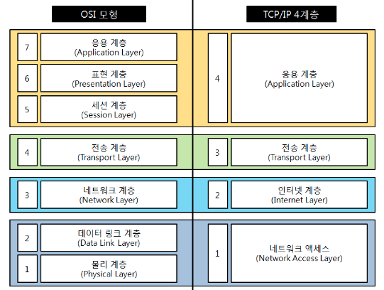
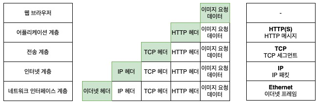

# OSI 7 Layers + TCP/IP + UDP

## OSI 7 Layers

---

### 개념

- 네트워크 통신이 일어나는 과정을 7단계로 나눈 것

### 필요 이유

- 네트워크 통신의 흐름을 한눈에 알아보기 위함
- 7단계 중 특정한 곳에 이상이 생길 시, 다른 계층의 장비나 sw 를 건들지 않고 이상이 생긴 단계만 고칠 수 있음

### 특징

1. 특정 계층이 변경되었을 때 다른 계층에 영향을 주지 않음
    
    ex. 4계층에서 tcp → udp 로 변경한다고 해서 인터넷 웹 브라우저를 다시 설치할 필요는 X
    
2. 각 계층을 거치며 캡슐화/비캡슐화 과정을 거침
    - `캡슐화`
        - 상위 → 하위 계층으로 내려갈 때
        - 상위 계층의 (헤더+데이터) 를 하위 계층의 데이터에 삽입하고, 해당 계층의 헤더를 추가
    - `비캡슐화`
        - 하위 → 상위 계층으로 올라갈 때
        - 각 계층의 헤더 부분을 제거

### 계층별 정리

1. Physical Layer (물리 계층)
    - `역할`
        - 데이터 → 전기 신호 변환 후 전달
        - 단지 데이터를 전달하는 역할
            - 전송하려는(받으려는) 데이터가 무엇인지, 어떤 에러가 있는지 등에 대해 신경 X
        - 전기적 신호가 나가는 물리적인 장비
    - `전송단위`
        - bit
    - `장비`
        - 케이블, 리피터, 허브
2. DataLink Layer (데이터링크 계층)
    - `역할`
        - 데이터의 물리적인 전송
        - 오류 제어
            - 오류 검출 + 회복
            - ex. CRC error detection
        - 흐름 제어 : 송신 측, 수신 측의 속도 차이 조정
        - 순서 제어 : 프레임의 순차적 전송
        - 재전송
        
        ⇒ 물리 계층을 통해 송수신되는 정보를 관리하여 안전한 정보의 전달을 수행할 수 있도록 도와줌
        
    - `전송단위`
        - frame
    - `주소`
        - 이더넷주소, 맥주소
    - `장비`
        - 브릿지, 스위치
    - `실제 프로토콜 예`
        - 이더넷, 맥주소
3. Network Layer (네트워크 계층)
    - `역할`
        - 패킷 전송
        - 라우터를 통해 경로와 주소를 정하고 패킷을 전달
            - 목적지까지 최적의 경로 설정
    - `전송단위`
        - 패킷
    - `주소`
        - ip 주소
    - `장비`
        - 라우터
    - `실제 프로토콜 예`
        - ip, icmp, 라우팅 프로토콜(RIP, OSPF)
4. Transport Layer (전송 계층)
    - `역할`
        - 양 끝단의 사용자들 간 (end-to-end) 데이터를 주고받게 해줌
        - 오류제어
        - 흐름제어
    - `전송단위`
        - 세그먼트
    - `주소`
        - 포트 번호
    - `실제 프로토콜 예`
        - TCP, UDP
5. Session Layer (세션 계층)
    - `역할`
        - TCP/IP 세션을 만들고 없앰
    - `실제 프로토콜 예`
        - SSH, Socket
6. Presentation Layer (표현 계층)
    - `역할`
        - 데이터의 형식 정의, 압축
    - `실제 프로토콜 예`
        - zip, mp4, mp3, avi, jpeg
7. Application Layer (응용 계층)
    - `역할`
        - 최종 목적지로, 사용자와 바로 연결되어 있음
            - 유저에게 통신을 위한 서비스 제공 (인터페이스 역할)
        - 응용 SW 를 도와주는 계층
        - 사용자로부터 정보를 입력받아 하위 계층으로 전달하고, 하위 계층에서 전송한 데이터를 사용자에게 전달
    - `주소`
        - 도메인주소
    - `실제 프로토콜 예`
        - http, smtp, ftp, telnet

## TCP/IP 4 Layers

---

### 개념

- TCP/IP 프로토콜 통신 과정에 초점을 맞춰, OSI 7계층을 좀 더 단순화 시킨 계층

### 계층별 정리

⇒ 각 계층 별 추가되는 헤더

1. 애플리케이션 계층 (Application Layer)
    - 역할
        - 사용자와 가장 가까운 계층
        - 사용자 - 소프트웨어 간 소통을 담당
        - 애플리케이션을 실행하기 위한 데이터 형식 지정
    - 프로토콜
        - HTTP, HTTPS, FTP, SSH, Telnet, DNS, SMTP

3. 전송 계층 (Transport Layer)

- 역할
    - 통신 노드 간 신뢰성 있는 데이터 전송을 보장
    - 포트 번호를 사용해 데이터를 정확한 애플리케이션에 전달하는 역할
        - 1계층, 2계층을 통해 데이터가 목적지 기기까지 전송적으로 도달 → 전송 계층이 포트번호를 사용해 데이터를 목적지 기기 내 적절한 애플리케이션으로 전달
- 프로토콜
    - TCP, UDP
1. 인터넷 계층 (Internet Layer) ⇒ OSI 에서의 3계층과 동일
    - 역할
        - 패킷을 최종 목적지까지 라우팅

1. 네트워크 액세스 계층 (Network Access Layer)

- 역할
    - 데이터 → 전기신호 변환
    - 물리적 주소인 MAC 주소를 활용해 알맞은 기기로 데이터 전달
- 프로토콜
    - 이더넷, 와이파이..

[[Network] TCP/IP 와 TCP/IP 4계층이란?](https://wooono.tistory.com/507)

→ TCP/IP 4계층과 TCP 통신과정(3&4 way handshake)

## UDP

---

### 특징

- 흐름제어, 오류제어, 재전송 X ⇒ 신뢰성 없음
- 간단

### TCP vs UDP

|  | tcp | udp |
| --- | --- | --- |
| 연결방식 | 연결형 서비스
(클라 ↔ 서버 간의 연결 setup 필요)
(연결설정 → 데이터전송 → 연결종료 과정 필요) | 비연결형 서비스 |
| 흐름,혼잡 제어 | O | X |
| 전송 순서 | 순서 보장 | 순서 보장 X |
| 수신 여부 확인 | 수신 여부 확인 | 수신 여부 확인 X |
| 신뢰성 | 높 | 낮 |
| 속도 | 느림 | 빠름 |
| 사용 예 | 신뢰성이 중요한 파일 전송 (ex. 이메일) | 실시간성(속도)이 중요한 동영상 스트리밍, 스포츠 중계, 음성 트래픽 |