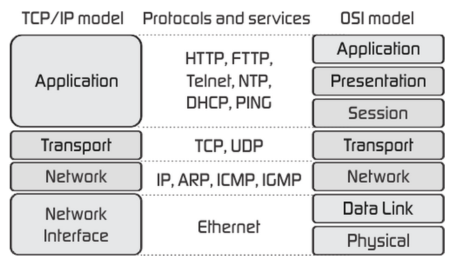

# OSI 7 Layers + TCP/IP stack 과의 비교, 차이

## OSI 7 Layers + TCP/IP 4 Layers

- **TCP/IP** Application 계층 = **OSI** Application 계층 + Presentation 계층 + Session 계층
- **TCP/IP** Internet 계층 = **OSI** Network 계층
- **TCP/IP** Link 계층 = **OSI** Data Link 계층 + Physical 계층

### 애플리케이션 계층

- FTP, HTTP, SSH, SMTP, DNS 등 응용프로그램이 사용되는 프로토콜 계층

<aside>
💡 **FTP**

장치와 장치 간의 파일을 전송하는 데 사용되는 표준 통신 프로토콜

**SSH**

네트워크 서비스를 안전하게 운영하기 위한 암호화 네트워크 프로토콜

**HTTP**

World Wide Web을 이용하는 데 쓰는 프로토콜

**SMTP**

전자 메일 전송을 위한 인터넷 표준 통신 프로토콜

</aside>

### 전송 계층

- 송신자와 수신자를 연결하는 통신 서비스를 제공, 애플리케이션과 인터넷 계층 사이의 중간 역할
- TCP와 UDP가 대표적인 예

<aside>
💡 **TCP**

- 패킷 사이의 순서 보장 O
- 연결지향 방식
- 가상회선 패킷 교환 방식 사용

**UDP**

- 패킷 사이의 순서 보장 X
- 비연결지향 방식
- 데이터그램 패킷 교환 방식 사용
</aside>

**가상회선 패킷 교환 방식**

- 각 패킷에는 가상회선 식별자가 포함되며 모든 패킷을 전송하면 가상회선이 해제됨
- 패킷들은 **전송된 순서**대로 도착함

**데이터그램 패킷 교환 방식**

- 패킷이 독립적으로 최적의 경로를 선택하여 이동
- 여러 패킷이 서로 다른 경로로 전송될 수 있음
- **도착한 순서가 다를수 있음**

### 인터넷 계층

- 장치로부터 받은 네트워크 패킷을 IP 주소로 지정된 목적지로 전송하기 위해 사용되는 계층
- IP, ARP, ICMP 등이 있음

### 링크계층

- 전선, 광섬유, 무선 등의 매체를 통해 실질적으로 데이터를 전달하며, 장치 간에 신호를 주고받는 ‘규칙’을 정하는 계층