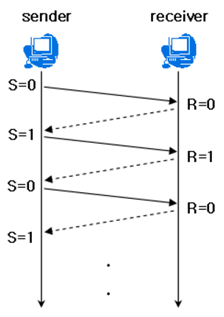
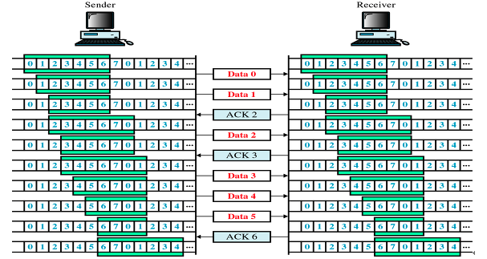
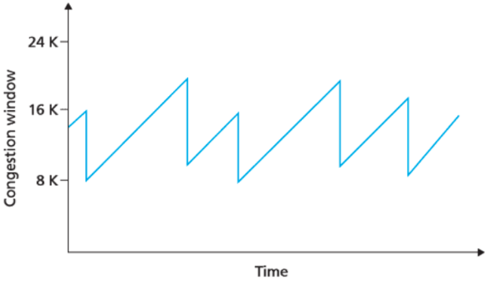

# TCP 3&4 way handshake + TCP 흐름제어와 혼잡제어

## TCP 3&4 way handshake

---

### 간단히

1. **3-way-handshaking**
    - tcp 에서 **송신자와 수신자 간 연결이 잘 되었는지** 확인하는 과정
    - 총 3번에 걸쳐 데이터를 주고받으며 통신이 정상적으로 가능한 상태인지 확인
2. **4-way-handshaking**
    - tcp 에서 **송신자와 수신자 간의 연결을 해제**하는 방법
    - 총 4번에 걸쳐 데이터를 주고받으며 연결을 끊음

[[네트워크]  3-way / 4-way Handshake 란?](https://bangu4.tistory.com/74)

## TCP 흐름제어, 혼잡제어

---

### 목적

- `reliable transport (신뢰성 있는 전송)`
    1. 패킷 손실 X
    2. 패킷 순서 보장
    3. 오류나 중복 없게
    
    ⇒ 보낸대로 받을 수 있도록
    

### 흐름제어 vs 혼잡제어

- **흐름제어 (Flow Control)**
    - 두 컴퓨터가 연결되어 있고, 그 사이에 이 두 컴퓨터 외에 어떤 트래픽도 오가지 않는데 수신자가 제대로 못받았다면 ⇒ 송신/수신자 간(end-system 들 간)의 capacity 차이(TCP 버퍼 크기 차이) 문제 (살짝 사양 차이 느낌)
        
        <aside>
        ❓ TCP 버퍼란
        
        ---
        
        - 송신 측 : 버퍼에 TCP 세그먼트 보관 후 순차적으로 전송
        - 수신 측 : 도착한 TCP 세그먼트를 애플리케이션이 읽어갈 때까지 버퍼에 보관
        </aside>
        
    - 데이터 처리 속도가 수신 측 > 송신 측 이라면 문제 없지만, 수신 측 < 송신 측 인 경우 문제 발생
        - 수신 측의 제한된 저장 용량 이후에 도착하는 패킷들은 손실될 수 있음
        - 패킷 손실 발생 시 불필요한 추가 패킷 전송 발생
    
    ⇒ 즉, `수신 측과 송신 측의 TCP 버퍼 크기 차이 → 데이터 처리 속도 차이` 로 인해 발생하는 문제 해결
    
    - 대충 어떻게?
        - 수신자가 송신자에게 자신의 현재 상태를 피드백 → 수신자가 패킷을 지나치게 많이 받지 않도록 조절
- **혼잡제어 (Congestion Control)**
    - end-system 들에는 문제가 없는데, 네트워크의 혼잡성 때문에 발생하는 문제
    - 데이터의 양이 라우터가 처리할 수 있는 양을 넘어가면, 라우터는 이를 처리하지 못함 → 송신 측에서 라우터에서 처리 못한 데이터들을 손실로 간주하고 계속 데이터 재전송 → 네트워크 혼잡 발생
    - 네트워크 혼잡의 증상
        - 패킷 손실
            - 라우터에서 버퍼 오버플로우
        - delay 증가
            - 라우터 버퍼에서 queueing
    
    ⇒ 즉, `네트워크 내의 패킷 수를 조절 → 네트워크 오버플로우 방지` 하는 것
    

### 흐름 제어 기법

1. **Stop & Wait**
    
    
    
    - 매번 **전송한 패킷에 대해 응답을 받아야만 그 다음 패킷을 전송**
    - 패킷 손실이 발생했다면, 재전송
    - **Window(Pipeline) 크기 : 1**
        - 수신 측으로부터 ACK 을 받기 전까지 보낼 수 있는 패킷의 개수가 1개

1. **Pipelined Protocol**
    - stop & wait 의 한계를 보완하기 위함
        - stop & wait 는 단 한개의 패킷을 보내고, ACK 받기 전까진 전송을 안함 ⇒ low link utilization
        
        ⇒ **ACK 받기 전까지 여러 개의 패킷을 전송**하고 싶다!
        
    - **Window 크기 (Pipeline 크기) > 1**
        - ACK 을 받기 전까지 보낼 수 있는 패킷의 개수
        - 송신 측은 실제 데이터를 보내기 전에 3-way-handshaking 을 통해 수신 측의 버퍼 사이즈에 window 크기를 맞춤
    - **윈도우에 포함되는 모든 패킷을 전송**하고, **패킷들의 전달이 확인되는 대로 윈도우를 옆으로 옮김**으로써 그 다음 패킷을 전송
        
        
        
    
    1. `Sliding Window (Go-Back-N)`
        - 누적 ACK 활용
            - n 번 패킷까지는 잘 받았다는 의미
        - 타이머 만료 시 → ack 처리되지 않은 모든 패킷들을 재전송
    2. `Selective Repeat`
        - 개별 ACK 활용
            - n 번 패킷을 잘받았다는 의미
        - 타이머 만료 시 → 해당 패킷 한개만 재전송

### 혼잡 제어 기법

1. **AIMD (Additive Increase / Multiplicative Decrease)**
    
    
    
    - loss 가 일어날 때까지는 전송률(cwnd: congestion window size) 을 증가시킴
    - 증가시킬 때는 additive, 감소시킬 때는 multiplicative
        - `additive`: loss 없는 경우 보내고 나서 응답 올때마다 (RTT 마다) cwnd +1
        - `multiplicative`: loss 발생시 cwnd / 2
2. **Slow Start**
    - cwnd `1 로 시작`
    - `최초 loss 발생 전까지 RTT 마다 cwnd * 2`
        - loss 발생 후 cwnd 크기는 TCP Tahoe, Reno 등 정책에 따라 다름
3. **빠른 재전송 (Fast Retransmit)**
    - 중복 ACK 을 바탕으로 패킷 손실을 detect
        
        ex. 2번 패킷에 대한 ACK 을 받았는데, 또다시 2번 패킷에 대한 ACK 을 받는 경우 → 패킷 손실 가능성
        
    - `중복 ACK 을 3개 이상` 받았다면, `time-out 전이라도 패킷 재전송`
4. **빠른 회복 (Fast Recovery)**
    - 혼잡 발생 시 윈도우 크기를 1로 줄이지 않고 `반으로 줄이는 방식`
    - 이 정책 적용 시점부터는 AIMD 를 따르게 됨