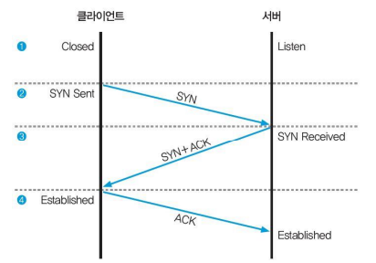
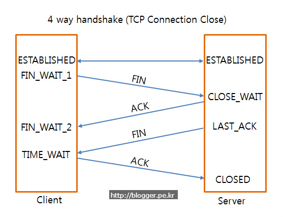

# TCP 3 & 4 way handshake + TCP/IP 흐름제어 & 혼잡제어

### TCP 연결 성립 과정

- 아래의 3-way handshake 과정을 진행하여 신뢰성을 구축함

1. SYN 단계 : 클라이언트는 서버에 클라이언트의 ISN(Initial Sequence Number)를 담아 SYN을 보낸다.
2. SYN + ACK 단계 : 서버는 클라이언트의 SYN을 수신하고 서버의 ISN을 보내며 승인번호로 클라이언트의 ISN + 1을 보낸다.
3. ACK 단계 : 클라이언트는 서버의 ISN + 1한 값인 승인번호를 담아 ACK을 서버에 보낸다.

### TCP 연결 해제 과정

- 아래의 4-way handshake 과정을 진행하여 연결을 해제함

1. 클라이언트가 연결을 닫으려고 할 때 FIN으로 설정된 세그먼트를 보낸다. 그리고 FIN_WAIT_1 상태로 돌입하고 서버의 응답을 기다림
2. 서버는 클라이언트로 ACK이라는 승인 세그먼트를 보내고, CLOSE_WAIT 상태로 돌입한다.
    
    클라이언트는 ACK을 받으면 FIN_WAIT_2 상태로 돌입한다.
    
3. 서버는 AKC을 보내고 일정 시간 이후에 클라이언트에 FIN이라는 세그먼트를 보낸다.
4. 클라이언트는 TIME_WAIT 상태가 되고 다시 서버로 ACK을 보내서 서버는 CLOSED 상태가 된다.
    
    이후 클라이언트는 **어느 정도의 시간을 대기**한 후 연결이 닫히고, 해제된다.
    

<aside>
💡 **TIME_WAIT 상태에서 왜 어느 정도의 시간을 대기할까?**

1. 지연 패킷이 발생할 경우를 대비하기 위함
2. 클라이언트와 서버 두 장치가 연결이 닫혔는지 확인하기 위해서이다.
</aside>

## TCP/IP 흐름제어 및 혼잡제어

[[네트워크] TCP/IP 흐름제어 & 혼잡제어 — 항상 끈기있게 (tistory.com)](https://nayoungs.tistory.com/entry/%EB%84%A4%ED%8A%B8%EC%9B%8C%ED%81%AC-TCPIP-%ED%9D%90%EB%A6%84%EC%A0%9C%EC%96%B4-%ED%98%BC%EC%9E%A1%EC%A0%9C%EC%96%B4)

## 흐름 제어

수신 측이 송신 측보다 데이터 처리 속도가 느릴 경우, 데이터 처리 속도 차이가 발생하는데, 이를 해결 하기 위해 흐름 제어를 한다.

- Stop and Wait Protocol
    - 상대에게 데이터를 보낸 후 잘 받았다는 응답이 올 때까지 기다리는 모든 방식을 통칭하는 말
    - 패킷을 하나씩 보내기 때문에 비효율
- Sliding Window
    - 수신 측이 한번에 처리할 수 있는 데이터를 정해놓고 그때그때 수신 측의 데이터 처리 상황을 송신 측에 알려줘서 데이터의 흐름을 제어하는 방식
    - 수신 측에서 설정한 윈도우 크기만큼 송신 측에서 확인 응답(ACK) 없이 패킷을 전송할 수 있게 하여 데이터 흐름을 동적으로 조절

## 혼잡 제어

데이터의 양이 라우터가 처리할 수 있는 양을 초과하면, 초과된 데이터는 라우터가 처리하지 못한다. 이때 송신 측에서는 라우터가 처리하지 못한 데이터를 손실 데이터로 간주하고 계속 재전송하여 네트워크를 혼잡하게 하는데, 이와 같은 네트워크의 혼잡을 피하기 위하여 송신 측에서 보내는 데이터의 전송 속도를 조절하는 작업

- AIMD (Additive Increase/Multiplicative Decrease)
    - 처음에 패킷을 하나씩 보내고, 문제 없이 도착하면 윈도우의 크기를 1씩 증가시킴
    - 만약 전송에 실패하거나 일정 시간을 넘기면 윈도우의 크기를 반으로 줄임
    - 윈도우의 크기를 굉장히 조금씩 늘리기 때문에 네트워크의 모든 대역을 활용하여 제대로 된 속도로 통신하기까지 시간이 오래걸린다는 단점
- Slow Start
    - 윈도우의 크기를 선형적 증가가 아닌, 기하급수적으로 증가시킴
    - 만약 전송에 실패하거나 일정 시간을 넘기면 윈도우의 크기를 1로 줄임
- Fast Recover
    - 혼잡상태시, 윈도우 크기를 1로 줄이지 않고, 반으로 줄이는 대신 선형 증가시키는 방법
    - 혼잡 상황을 한 번 겪고나서부터는 AIMD 방식으로 동작함
- Fast Retransmit
    - 수신자 입장에서는 세그먼트로 분할된 내용들이 순서대로 도착하지 않는 경우가 생길 수 있음
    - 이러한 상황이 발생했을 때 수신자는 순서대로 잘 도착한 마지막 패킷의 다음 순번을 ACK 패킷에 실어 보내고, 이런 중복 ACK를 3개 받으면 재전송이 이루어짐
    - 송신자는 자신이 설정한 타임 아웃 시간이 지나지 않았어도 바로 해당 패킷을 재전송할 수 있기 때문에 보다 빠른 재전송률을 유지할 수 있음