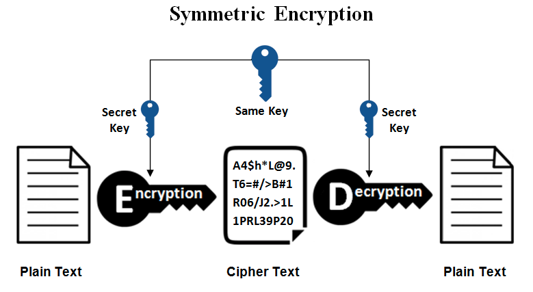
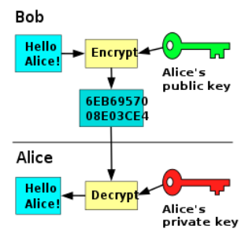
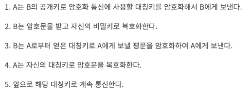

# 대칭키 & 공개키

## 대칭키 & 공개키(비대칭키)

---

### 대칭키

- **암호화 / 복호화에 사용되는 키가 동일**
- `장점`
    - 빠름
- `단점`
    - 키 전달 과정에서 해킹 위험

### 비대칭키 (공개키)

- **암호화 / 복호화에 사용되는 키가 서로 다름**
- 두가지 방식
    1. 상대방의 공개키로 암호화 → 상대방의 개인키로 복호화
        - 보내는 정보 자체를 암호화하여 내가 보내고자 하는 상대방만 확인할 수 있게 하고싶을 때
    2. 자신의 개인키로 암호화 → 자신의 공개키로 복호화
        - 내가 보내는 정보라는걸 증명하고 싶을 때
            - 나의 공개키로 열린다면, 그건 내가 보낸게 맞음
            - 보내는 정보 자체는 누구나 열어볼 수 있음
- `장점`
    - 키가 공개되어 있기 때문에 따로 키 교환 필요 X
    - 키 전달 문제에 대해 보다 안전
- `단점`
    - 암호화 / 복호화를 위해 복잡한 수학 연산이 필요
    - 느림

### HTTPS 에서의 활용 (SSL)

- `대칭키 + 공개키` 둘다 활용
    - 공개키만을 사용할 경우, http 메시지의 길이가 긴 경우 암복호화 부하
- 공개키를 이용해 대칭키를 전달 → 대칭키를 가지고 통신
    
    
    

[무조건 이해 시켜드립니다. 대칭키와 비대칭키에 대하여](https://universitytomorrow.com/22)