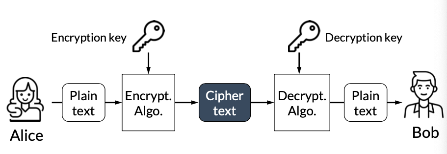
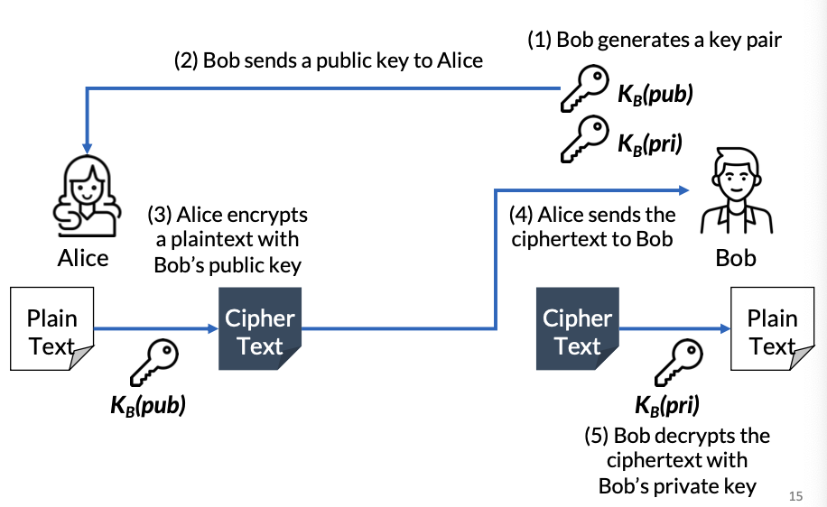

# 대칭키와 비대칭키(공개키)

태그: 네트워크, 보안

# 기본적인 암호화 구조

발신자 → Plain text(평문) + 암호화(암호키 + 알고리즘) → Cipher text(암호화된 텍스트)

Cipher text + 복호화(복호키 + 알고리즘) → Plain text → 수신자

이 때, 암호키와 복호키가 **같으면 대칭키(Symmetric), 다르면 비대칭키(Asymmetric)** 라고 부른다.

## 대칭키 : 키 분배 문제 (Key Distribution Problem)

> 어떻게 하면 발신자와 수진자에게 키를 보안적으로 분배할 수 있을까?
> 

### Q. key를 암호화된 메세지와 함께 보내는건?

A. 안된다. 공격자가 Key와 암호화된 텍스트 둘다 가져가면 소용없다.

### Q. 암호 / 복호 시 사용되는 알고리즘 자체를 암호화하는건?

A. 별로다. 역사적으로 모든 알고리즘들이 공개되었고, 비공개되었더라도 한번 공개되면 보안적인 힘이 매우 약해진다.

→ 암호화에 있어서 강력한 힘은 **반드시 Key에만 의존해야 한다.**

### Q. 모든 사용자에게 ‘사전에’ key를 모두 분배하는건?

A. 비효율적이다. n명이 있다고 할 때, 사람들 사이엔 서로 다른 독립적인 key가 사용되어야 하고,
이러면 n * (n-1) /2 = O(n^2)개의 키가 분배되어야 한다.

### Q. 신뢰성 있는 제3의 기관(Key Distribution Center, KDC)에서 key를 보관, 분배하는건?

A. 좋지만 이 특징만 단일적으로 사용하는 건 SPOF(Single Point of Failure, 단일 장애점) 한계가 있다. 

### 결론 : 대칭키로는 분배 문제에 있어 보안에 약할 수 밖에 없다.

# Public Key (공개키)

> Asymmetric Key (비대칭키)라고도 불린다.
> 
- 암호화 키를 공개키(public key)로, 복호화 키를 개인키(private key)로 비대칭적으로 가진다.
- 따라서 공개키로 암호화, 개인키로 복호화하는 과정이다. (그러므로 공개키만 공유된다)
    
    
    
    1. Bob이 키 쌍(Bob’s 공개키, Bob’s 개인키)를 생성한다.
    2. Bob이 (Bob’s 공개키)를 Alice에게 보낸다.
    3. Alice는 보내려는 메세지(Plain Text)를 (Bob’s 공개키)로 암호화한다.
    4. Alice는 암호화된 메세지(Cipher Text)를 Bob에게 보낸다.
    5. Bob은 받은 암호화된 메세지를 (Bob’s 개인키)로 복호화하여 메세지를 확인한다.

### Q. 만약 공격자가 CipherText와 Public key를 둘다 얻었을 때는?

A. 어차피 CipherText는 private key 없으면 복호화하지 못하기 때문에 괜찮다. (비대칭키의 강점)

# 대칭키 vs 비대칭키

## 대칭키 (Symmetric)

### 장점

- 높은 데이터 처리율 (Data throughput)
- 키 용량(key size)이 상대적으로 작다.

### 단점

- 반드시 발신자, 수신자 모두가 키를 보유해야 한다.
- O(n^2)개의 키가 관리되어야 한다.
- 상대적으로 키의 생명주기가 짧다.

## 공개키 (Public, Symmetric)

### 장점

- O(n)개의 키로 관리 가능
- 개인키(private key)만 지키고 있으면 된다.
- 상대적으로 키의 생명주기가 길다.
- 전자 서명으로 개인키를 대체할 수 있다.

### 단점

- 낮은 데이터 처리율 (Data throughput)
- 키 용량(key size)가 상대적으로 크다.

## 대칭키가 O(n^2)개의 키가 관리되는 이유

n명의 user 중 각각의 시점에서 계산해보자.

user1 : user2와의 key + user3과의 key + … + user(n)과의 key ⇒ (n-1)개 키 필요

user2 : user3과의 key + user4와의 key + … + user(n)과의 key ⇒ (n-2)개 키 필요

…

user(n-1) : user(n)과의 key ⇒ 1개 필요

-> **1 + 2 + … + n-1 = $n(n-1)/2$ ⇒ O(n^2)개가 관리되어야 한다.**

## 비대칭키가 O(n)개의 키가 관리되는 이유

n명의 user 중 각각의 시점에서 계산해보자.

user1 : user1의 private key + user1의 public key ⇒ 2개 필요

user2 : user2의 private key + user2의 public key ⇒ 2개 필요

…

user(n-1) : user(n-1)의 private key + user(n-1)의 public key ⇒ 2개 필요

user(n) : user(n)의 private key + user(n)의 public key ⇒ 2개 필요

-> **n * 2 = 2n ⇒ O(n)개가 관리되어야 한다.**