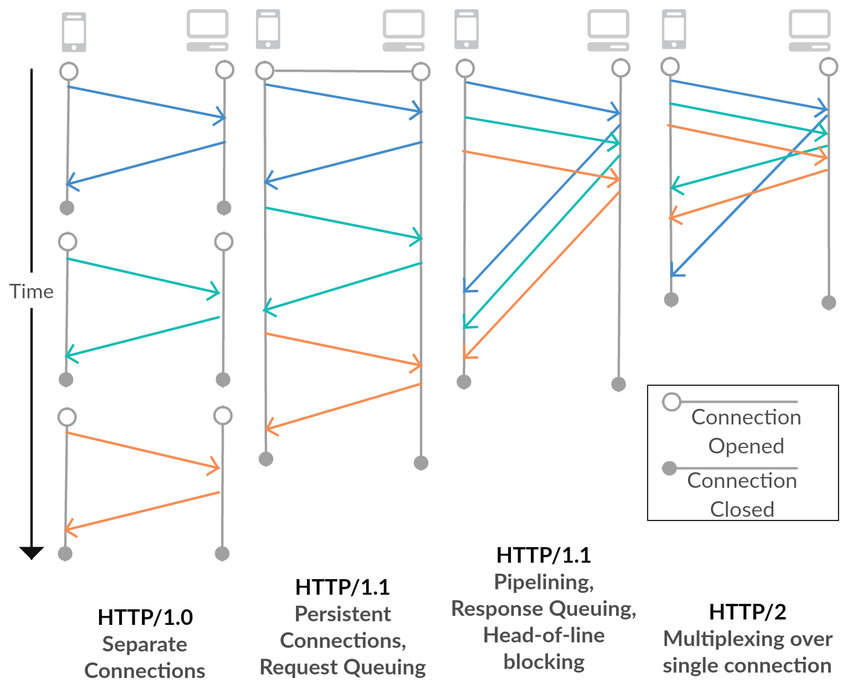

# HTTP 1.0 1.1 2.0 3.0

# 초기 HTTP (HTTP/0.9)

- GET 만 가능 (서버로부터 정보 조회만)

# HTTP 1.0

- HTTP 헤더 : 헤더 기능을 도입함으로써 메타데이터 전송 가능
- Versioning : 해당 HTTP의 버전을 명시적으로 알려준다
- Status Code : 상태 코드를 통해 Receiver가 요청 처리상태를 확인할 수 있다.
- Content-type : Header로 인해 HTTP는 일반 html 파일 뿐만 아니라 다른 문서유형도 전송 가능
- POST, HEAD : 새로운 메서드 추가

# HTTP 1.1

- **Host header** : 호스트 헤더는 프록시 서버를 통해 메시지를 라우팅 할때 특히 중요합니다, Host header를 통해 동일한 IP를 가리키는 도메인을 구분할 수 있습니다.
- **Persistent connections** : HTTP 1.0에서는 각각의 request와 response 가 새로운 연결을 엽니다. 반면 HTTP 1.1 에서는 여러 요청을 single connection을 사용하여 실행할 수 있습니다.
- **Continue status** : 서버가 처리할 수 없는 요청을 처리하는것을 거부하는 것을 방지하기 위해, 클라이언트는 먼저 요청 헤더만 보내고 계속 상태 코드(100)를 수신하는지 확인할 수 있습니다.
- **New methods** : HTTP 1.1에서는 PUT, PATCH, DELETE, CONNECT, TRACE, 그리고 OPTIONS 메서드가 추가 되었습니다.
    - 추가로 PUT method는 이미 존재하는 자원을 수정하는 역할을 합니다.
    - PATCH 메서드는 이미 존재하는 리소스의 특정 데이터를 업데이트합니다(PUT은 전체를 업데이트 합니다)
    - DELETE는 이미 존재하는 자원을 삭제합니다.

# HTTP 2.0

- **Request multiplexing** : HTTP 1.1은 순차적인 프로토콜 입니다. 그래서 한번에 하나의 요청만 보낼수 있습니다. 반면에 HTTP 2.0에서는 요청을 보내고 응답을 비동기적으로 수신 받을 수 있습니다. 그렇기 때문에 단일 연결을 사용하여 여러 요청을 동시에 수행할 수 있습니다.
- **Request prioritization** : HTTP 2.0을 사용하면 요청 배치에서 숫자 우선 순위를 설정할 수 있습니다. 따라서 JS 파일을 응답 받기전에 웹페이지 CSS를 받는 것과 같은 응답을 예상하는 순서를 명시할 수 있습니다.
- **Automatic compressing** : HTTP 1.1 버전에서는, 요청 및 응답의 압축을 명시적으로 요구해야 합니다. 반면에 HTTP2.0에서는 GZip 압축을 자동으로 실행합니다.
- **Connection reset** : 어떤 이유로 인해 서버와 클라이언트 간의 연결을 닫고 즉시 새 연결을 열 수 있는 기능을 말합니다
- **Server push** : 서버가 많은 요청을 받는 것을 피하기 위해, HTTP 2.0은 서버 푸시 기능을 도입했습니다. 이 기능을 통해 서버는 곧 요청될 리소스를 예측하려 합니다. 따라서 서버는 이러한 리소스를 클라이언트 캐시에 사전에 푸시합니다. 클라이언트의 요청을 최소화 해서 성능 향상을 이끌어 냅니다.

# HTTP 3.0

- QUIC protocol 도입 → 내장 암호화 기술 + Native Multiplexing
    - 항상 암호화된 연결
    - UDP를 활용한 더욱 빠른 전송