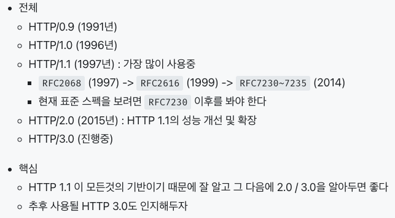

# HTTP 1.1, 2.0, 3.0 비교

## HTTP 역사

---



### http 0.9

- 특징
    - http 초기 버전
    - http header 없음
- 요청
    - `단일 라인`
    - 메소드 : `GET`
- 응답
    - 파일 내용 그 자체
    - `html 파일만` 전송 가능

```
/* 요청 */
GET /mypage.html

/* 응답 */
<HTML>
A very simple HTML page
</HTML>
```

### http 1.0

- 특징
    - `http header` 개념 도입
- 요청
    - 버전 정보 포함
    - 메소드 : `GET, POST, HEAD`
- 응답
    - `상태 코드` 추가
        - 요청의 성공/실패 여부 판단 가능
    - `Content-Type` 도입
        - html 파일 외 다른 것들을 보낼 수 있게 됨
- 한계
    - 커넥션 하나 당 요청 하나, 응답 하나만 처리 가능 (`Connectionless / Stateless`)
        - 모든 요청마다 새로운 TCP 요청 생성&해제 수행
        
        ⇒ http 1.1 에서 개선
        

```
/* 요청 */
GET /mypage.html HTTP/1.0
User-Agent: NCSA_Mosaic/2.0 (Windows 3.1)

/* 응답 */
200 OK
Date: Tue, 15 Nov 1994 08:12:31 GMT
Server: CERN/3.0 libwww/2.17
Content-Type: text/html
<HTML>
A page with an image
  
</HTML>
```

### http 1.1

- 요청
    - 메소드 : `GET, HEAD, POST, PUT, DELETE, TRACE, OPTIONS`
- 특징
    - http `표준`
    - `persistent connection` (HTTP Keep-Alive)
        - 지정한 timeout 동안 커넥션을 닫지 않고 유지
        - TCP 세션 처리 부하 줄임
    - `pipelining` (HTTP Pipelining)
        - 앞 요청의 응답을 기다리지 않고 순차적인 여러 요청을 연속적으로 전송 → 그 순서에 맞춰 응답 받기
            - 하나의 커넥션에 여러 요청이 들어있는 것일 뿐, 동시에 여러개의 요청을 처리해주는건 X
- 한계
    - `head of line blocking` (HOL)
        - 앞 요청의 응답이 넘 오래걸리면 뒤 요청이 blocking 됨
    - `header 중복`
        - 연속된 요청들의 헤더가 중복됨

```
/* 요청 */
GET /en-US/docs/Glossary/Simple_header HTTP/1.1
Host: developer.mozilla.org
User-Agent: Mozilla/5.0 (Macintosh; Intel Mac OS X 10.9; rv:50.0) Gecko/20100101 Firefox/50.0
Accept: text/html,application/xhtml+xml,application/xml;q=0.9,*/*;q=0.8
Accept-Language: en-US,en;q=0.5
Accept-Encoding: gzip, deflate, br
Referer: https://developer.mozilla.org/en-US/docs/Glossary/Simple_header

/* 응답 */
200 OK
Connection: Keep-Alive
Content-Encoding: gzip
Content-Type: text/html; charset=utf-8
Date: Wed, 20 Jul 2016 10:55:30 GMT
Etag: "547fa7e369ef56031dd3bff2ace9fc0832eb251a"
Keep-Alive: timeout=5, max=1000
Last-Modified: Tue, 19 Jul 2016 00:59:33 GMT
Server: Apache
Transfer-Encoding: chunked
Vary: Cookie, Accept-Encoding

(content)
```

### http 2.0

- 특징
    - http 1.1 을 확장 (성능 향상)
    - http 메시지 전송 방식 변경
        - 일반 텍스트 → 바이너리
    - `Multiplexed Stream`
        - http 1.1 의 HOL 해결
        - 하나의 커넥션 안에 여러 개의 stream 을 둬서, 요청마다 구분되는 stream 을 통해 응답 전달 ⇒ 여러 요청을 비동기적으로 처리 가능
    - `Stream Prioritization`
        - stream 과 리소스에 우선순위 설정 가능
    - `Server Push`
        - 단일 클라 요청에 여러 응답을 줄 수 있다는 특징을 활용 ⇒ 서버에서 클라로 추가적인 리소스 push 가능
    - `Header Compression`
        - http 1.1 의 header 중복 문제 해결
- 한계
    - 아무리 stream 을 나눈다 한들, TCP 고유의 HOL 문제를 해결할 순 없다!
        - TCP 에서는 기본적으로 no loss 를 지향하기 때문에 데이터 유실될 경우 어쩔수 없이 지연이 발생하기 때문

### http 3.0

- 특징
    - `UDP 기반` 프로토콜인 `QUIC` 적용
        - Quick UDP Internet Connections
        - TCP 3-way-handshake 과정을 최적화
        - 네트워크 지연, 패킷 손실이 많은 상황에서 좋은 성능
        - 별도의 보안 계층 필요 X
            - 기본적으로 TLS 내장