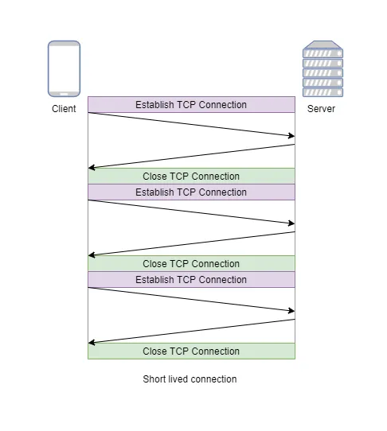
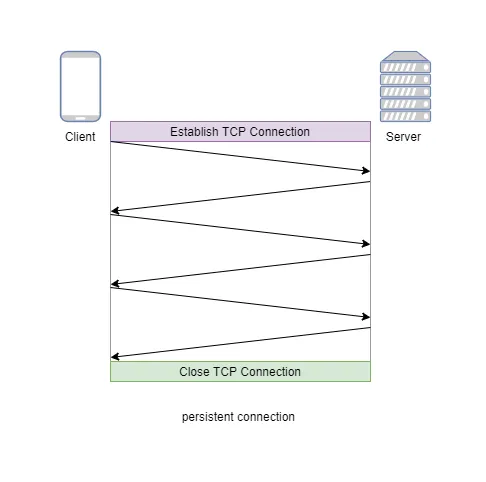
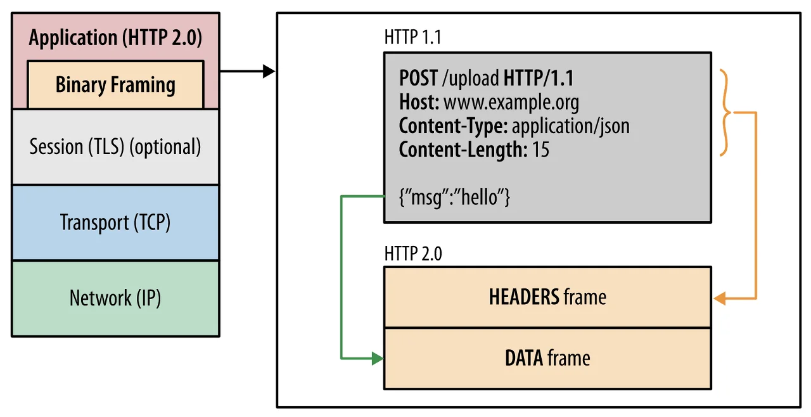
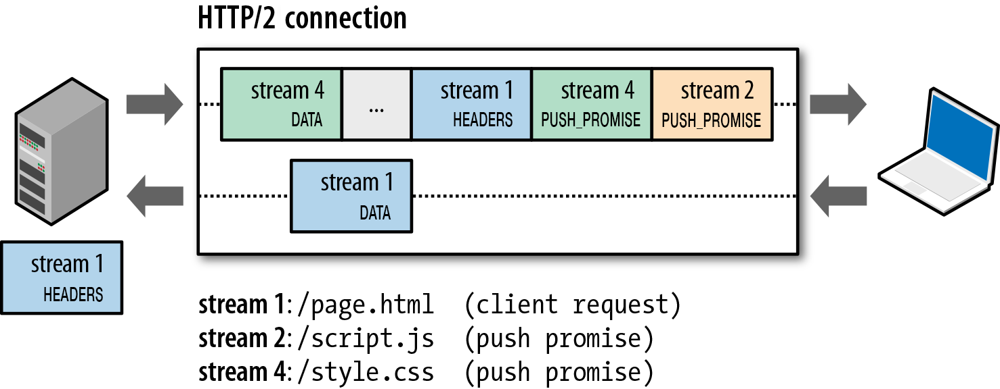
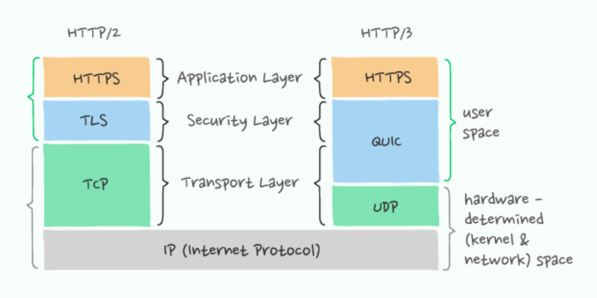

# HTTP/1.1 , 2.0, 3.0 각각의 특징과 비교

# HTTP/1.0 /1.1 /2.0 /3.0

## HTTP/1.0

- 1 Request & 1 Response **per 1 Connection**
    
    → 매번 새로운 연결로 성능 ↓
    → 서버 부하 비용 ↑
    

## HTTP/2.0

- Persistent Connection
    
    : 지정한 timeout동안 커넥션을 닫지 않는 방식
    
- Pipelining
    
    : 하나의 커넥션에서 **응답을 기다리지 않고 순차적인 여러 요청을 연속적으로 보내**고, 그 순서에 맞춰 응답을 받는 방식으로 지연 시간을 줄이는 방법
    
    문제점1 : Head of Line Blocking ;
    
    → 첫번째 요청에 대한 응답을 처리하는 동안, 두 번째, 세 번째 요청들에 대해서 지연되는 현상
    
    문제점 2 : Header 구조의 중복
    

## HTTP/2

기존 HTTP/1.X 버전의 성능 향상에 초점을 맞춘 프로토콜

- Binary Framing
    - HTTP 메시지를 바이너리 형태의 프레임으로 나누고 이를 전송, 받은 쪽에서 다시 조립
    - 파싱, 전송 속도 ↑
    - 오류 발생 가능성 ↓
    
    
    
- Request and Response Multiplexing
    - 하나의 연결 내 여러 스트림을 사용
    - Head of blocking 문제 해결
    
    
    
- Stram Prioritization
    - 리소스간 우선순위 설정 가능
- Server Push
    - 클라이언트의 별도 요청 없이 서버가 “클라이언트에서 필요하겠다”라고 판단하면 바로 리소스를 푸시

- Header Compression
    - 헤더의 크기를 줄여 페이지 로드 시간 감소
    - 호프만 인코딩을 사용하여 중복된 헤더에 대해서 압축

## HTTP/3

- TCP 위에서 돌아가는 HTTP/2와는 달리 QUIC이라는 계층 위에서 돌아감
- 구글에서 개발
- UDP 기반으로 돌아감 (**따라서, TCP 3-way handshake를 거치지 않아도 됨**)
- 또한 TCP만큼 신뢰성을 확보할 수 있
- 첫 연결 설정에서 필요한 정보와 함께 데이터를 전송
    
    → 연결 성공 시 설정을 캐싱하여, 다음 연결 때 바로 성립 가능
    

[https://www.youtube.com/watch?v=xcrjamphIp4](https://www.youtube.com/watch?v=xcrjamphIp4)