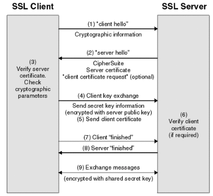

# TLS & SSL handshake

## TLS & SSL, handshake

---

### SSL(Secure Socket Layer) 이란?

- 용도
    - 정보 암호화
- 대칭키, 공개키의 활용
    - 둘다 활용
        - 공개키만을 사용할 경우, http 메시지의 길이가 긴 경우 암복호화 부하
            
            ( 공개키 방식은 암호화에 강하지만, 암/복호화가 느리다는 단점 )
            
    - 공개키를 이용해 대칭키를 전달 → 대칭키를 가지고 통신
        - 여기서 공개키를 전달해 주는 것이 CA 의 역할? 인듯
        
        
        

### CA (Certificate Authority) 란?

- SSL 인증서 발급
- 공개키를 저장해주는 신뢰성이 검증된 민간 기업
- 다양한 서버들의 공개키 저장소
    - 즉, 서버 애플리케이션 만들 때 CA 를 통해 인증서 발급받는 행위 == 해당 CA 에게 내 서버의 공개키 관리를 맡기는 것

### SSL 인증서란?

- SSL 프로토콜이 동작할 수 있게 해줌
- 클라 ↔ 서버 간의 통신을 제3자가 보증해주는 전자화된 문서
- 대충 흐름
    - `클라 → 서버 접속` ⇒ `서버 → 클라에게 인증서 전달` ⇒ `클라는 인증서가 신뢰할 만한지 확인` ⇒ `클라의 원하는 작업 수행`
- 인증서 내용
    - 서비스 정보
        - 인증서를 발급한 CA
        - 서비스의 도메인
        - 기업의 이름.. 등등
    - 서버의 공개키
- 인증서의 암복호화
    - 공개키 암호화 기법 사용
    - 암호화 : `인증서 내용` 을 `CA 의 비공개키` 로 암호화
    - 복호화 : `브라우저가 보유한 CA 의 공개키` 로 복호화
        - 브라우저는 검증된 CA 기업의 공개키를 모두 보유하고 있음
        - 복호화를 성공적으로 할 수 있다는 것 ⇒ 인증서가 CA 로부터 온 것임을 증명 ⇒ 인증서 내부에 존재하는 서버의 공개키가 CA 를 통해 보안성이 검증되었음을 증명 ⇒ 해당 서버는 신뢰할 수 있는 사이트다!
        - 서버의 공개키를 활용 ⇒ 대칭키인 “세션키” 생성 ⇒ 이후 서버와 클라는 세션키를 통해 통신
- 흐름 정리 땅땅
    1. 서버 → CA(Certificate Authority)(인증기관) 에게 인증 요청
    2. CA 에서 검증
    3. 인증서를 CA 의 개인키로 암호화 → 서버에게 제공
    4. 클라 → 서버 접속 요청
    5. 서버는 클라에게 인증서 전송
    6. 클라의 인증서 복호화 (브라우저 활용) → 신뢰성 검증
    7. 클라는 서버의 공개키로 세션키를 암호화해서 전송
    8. 서버는 자신의 개인키로 세션키를 복호화
    9. 이후 서버, 클라는 해당 세션키로 통신

### https 는 무조건 안전한가?

- 아님
- ex. 신뢰받는 CA 기업에서 발급한 인증서가 아닌 경우
    
    ⇒ 브라우저 상에서 ‘주의 요함’, ‘안전하지 않은 사이트’ 같은 알림 받게 됨
    

### TLS(Transport Layer Security) 란?

- 가장 최신 기술
- 더 강력한 버전의 SSL
- 하지만 SSL 이 더 일반적으로 사용되는 용어이며, 여전히 보안 인증서는 SSL 이라고 불림

### TLS/SSL Handshake 란?

- SSL 프로토콜을 활용해 통신을 수립하는 과정

1. client hello
    - 클라 → 서버로 ‘hello 메시지’ 를 보내며 핸드쉐이킹 시작
    - ‘hello 메시지’ 내용
        - 클라가 지원하는 SSL 버전
        - 지원되는 암호 제품군 (암호 알고리즘?)
        - 무작위 바이트 문자열 (’client random’ 이라고 불림)
2. server hello
    - 클라의 ‘hello 메시지’ 에 대한 응답
    - 응답 내용
        - 서버의 SSL 인증서
        - 서버에서 선택한 암호 제품군
        - 서버에서 생성한 무작위 바이트 문자열 (’server random’ 이라고 불림)
3. verify server certificate
    - SSL 인증서 검증
    - 서버의 공개키 획득
4. client key exchange
    - 무작위 바이트 문자열(’The premaster secret’ 이라 불림. 후에 세션키를 정하는데 사용됨) 을 서버의 공개키로 암호화해서 서버로 전송
5. ~~send client certificate~~
    - ~~서버가 클라이언트의 인증서를 요구한다면 클라의 인증서 전송~~
        - ~~인증서와 함께 클라의 개인키로 암호화된 임의의 문자열 바이트도~~
6. verify client certificate
    - 서버의 개인키로 ‘The premaster secret’ 복호화
7. client “finished”
    - 클라 측에서 ‘client random’ + ‘server random’ + ‘The premaster secret’ 을 이용해 세션 키(대칭키) 생성
    - 세션 키로 암호화된 ‘finished 메시지’ 전송
8. server “finished”
    - 서버 측도 클라랑 똑같은 방법으로 세션 키 생성
    - 세션 키로 클라에게 온 메시지 복호화(클라의 세션 키와 일치하는지 확인) ⇒ 성공 ⇒ 서버에서 만든 세션 키로 암호화된 ‘finished 메시지’ 전송
9. exchange message
    - 서버의 ‘finished’ 메시지를 클라 측의 세션키로 복호화 ⇒ 성공 ⇒ 핸드셰이킹 완료
    - 이후로는 세션 키를 이용해 메시지 주고받기