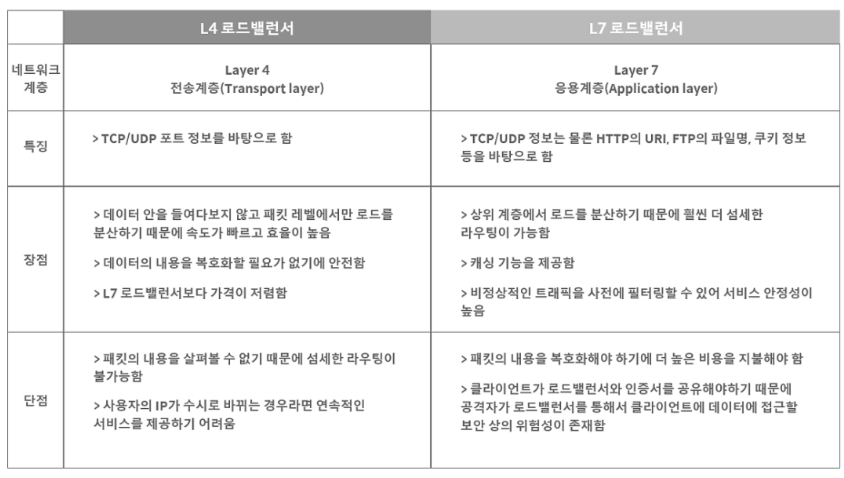

# 로드밸런싱 + Blocking/Nonblocking + Synchronous/Asynchronous

## 로드밸런싱

---

### 로드 밸런싱이란?

- 분산식 웹 서비스
- 여러 서버에 트래픽을 나눠주는 것

### 등장배경

- 트래픽 대응 방안
    - Scale - Up
        - 서버 하드웨어의 성능을 올리자
        - 비쌈
    - Scale - Out
        - 여러 대의 서버로 일을 나누자
        - 보다 싸고, 무중단 서비스 제공에도 유리

### 예시

- 서버 이중화의 경우
    - 2대 이상이 서버를 기반으로 가상 ip 제공 → 유저들은 로드밸런서가 제공한 해당 ip 로 접근 → 로드밸랜서가 트래픽을 여러 개의 서버로 나눠줌
    - 어느 하나의 서버에 문제가 생겨도 다른 하나의 서버가 요청 처리 가능

### 로드 밸런서가 서버를 택하는 방식

1. 라운드 로빈
    - 서버에 들어온 요청을 순서대로 돌아가며 배정
    - 여러 대의 서버가 동일한 스펙을 갖고 있는 경우 적절
2. least connection
    - 요청이 들어온 시점에 가장 적은 연결상태의 서버에 트래픽 배분
    - 서버에 분배된 트래픽들이 일정하지 않은 경우 적절
3. 사용자 ip 해싱
    - 클라의 ip 주소를 해싱 → 특정 서버로 매핑
    - 사용자가 항상 동일한 서버로 연결되는 것을 보장

### L4 로드밸런싱 vs L7 로드밸런싱

- 부하 분산에 가장 많이 활용되는 두 종류!
    - 이유는?
        - L4 로드밸런서부터 포트(port) 정보를 바탕으로 분산해 줄 수 있기 때문
            
            ex. 하나의 서버에 각기 다른 포트 번호를 부여해 다수의 서버 프로그램을 돌리는 경우, 최소 L4 이상이 필요!
            
- OSI 7 계층 구조에 따라 L1/L2/…/L7 까지 있음!
    - 상위 계층 장비는 하위 계층 장비의 모든 기능을 갖고 있음
    - 상위 계층으로 갈수록 정교한 로드밸런싱 가능
- `L4`
    - 4계층(전송 계층) 프로토콜의 헤더를 부하 분산에 활용
    - 3계층이나 4계층 정보를 활용
        - IP 주소, 포트번호,…
        
- `L7`
    - 7계층(응용 계층) 프로토콜의 헤더를 활용
    - 7계층 정보를 활용
        - HTTP 헤더, 쿠키, URL…
        
        ⇒ 클라이언트의 요청을 보다 세분화해 서버에 분산해줄 수 있음
        

[CS-Study/Network/로드밸런싱.md at main · Songwonseok/CS-Study](https://github.com/Songwonseok/CS-Study/blob/main/Network/로드밸런싱.md)

[로드 밸런싱에 대해 알아보자!](https://tecoble.techcourse.co.kr/post/2021-11-07-load-balancing/)

## Blocking / Non-blocking vs Synchronous / Asynchronous

---

[https://gyoogle.dev/blog/computer-science/network/Blocking,Non-blocking & Synchronous,Asynchronous.html](https://gyoogle.dev/blog/computer-science/network/Blocking,Non-blocking%20&%20Synchronous,Asynchronous.html)