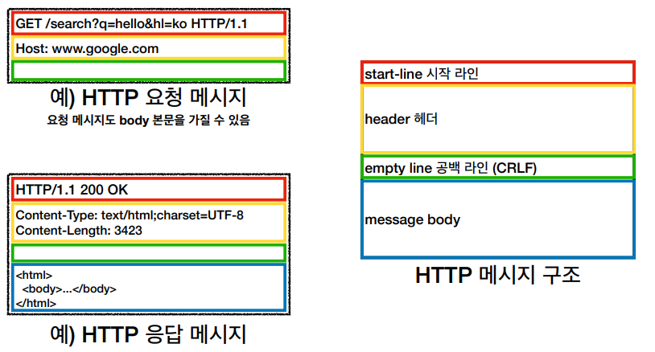

# HTTP와 REST

## HTTP란?

HyperText Transfer Protocol의 약자로, 웹 통신을 위해 정한 규약

## REST란

1. HTTP URI(Uniform Resource Identifier)를 통해 자원(Resource)을 명시하고,
2. HTTP Method(POST, GET, PUT, DELETE, PATCH 등)를 통해
3. 해당 자원(URI)에 대한 CRUD Operation을 적용하는 것

**HTTP URI를 통해 자원을 명시하고, HTTP Method를 통해 해당 자원에 대한 CRUD 작동을 적용**

**REST API란 REST의 원리를 따르는 API를 의미**

- **자원(RESOURCE)** - URI
- **행위(Verb)** - HTTP METHOD
- **표현(Representations)**

## URI는 리소스만 식별하자!

- 리소스와 해당 리소스를 대상으로 하는 행위을 분리
- 리소스: 회원
- 행위: 조회, 등록, 삭제, 변경
- 리소스는 명사, 행위는 동사 (미네랄을 캐라)
- 행위(메서드)는 어떻게 구분?
    - → HTTP 메서드
    - → 실무에서는 HTTP 메서드로만 URI를 표현하기 어려울 수도 있음

## HTTP 메서드 종류

### 주요 메서드

- GET : 리소스 조회
- POST : 요청 데이터 처리, 주로 등록에 사용
- PUT : 리소스를 대체, 해당 리소스가 없으면 생성
- PATCH : 리소스 부분 변경
- DELETE : 리소스 삭제

## HTTP 상태 코드

- 1xx (informational) : 요청이 수신되어 처리중
- 2xx (Successful) : 요청 정상 처리
- 3xx (Redirection) : 요청을 완료하려면 추가 행동이 필요
    - 영구 리다이렉션(301, 308)과 일시 리다이렉션(302, 307, 303)
- 4xx (Client Error) : 클라이언트 오류, 잘못된 문법등으로 서버가 요청을 수행할 수 없음
- 5xx (Server Error) : 서버 오류, 서버가 정상 요청을 처리하지 못함

## 영구 리다이렉션

### 301, 308

- 리소스의 URI가 영구적으로 이동
- 원래의 URL을 사용X, 검색 엔진 등에서도 변경 인지
- **301 Moved Permanently**
    - 리다이렉트시 요청 메서드가 GET으로 변하고, 본문이 제거될 수 있음
- **308 Permanent Redirect**
    - 301과 기능은 같음
    - 리다이렉트시 요청 메서드와 본문 유지(POST를 보냈을 경우 리다이렉트도 POST 유지)
    

## 일시 리다이렉션

### 302, 307, 303

- 리소스의 URI가 일시적으로 변경
- 따라서 검색 엔진 등에서 URL을 변경하면 안됨
- **302 Found**
    - 리다이렉트시 요청 메서드가 GET으로 변하고, 본문이 제거될 수 있음
- **307 Temporary Redirect**
    - 302와 기능은 같음
    - 리다이렉트시 요청 메서드와 본문 유지(요청 메서드를 변경하면 안된다.)
- **303 See Other**
    - 302와 기능은 같음
    - 리다이렉트시 요청 메서드가 GET으로 변경
    

내용 및 이미지 출처 : (HTTP 기본 지식 - 김영한)