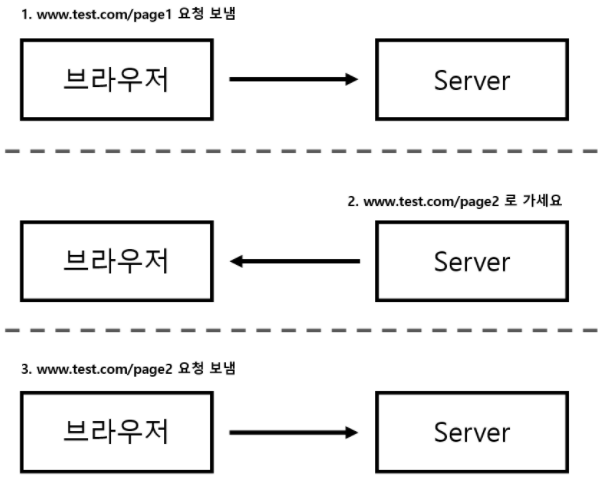
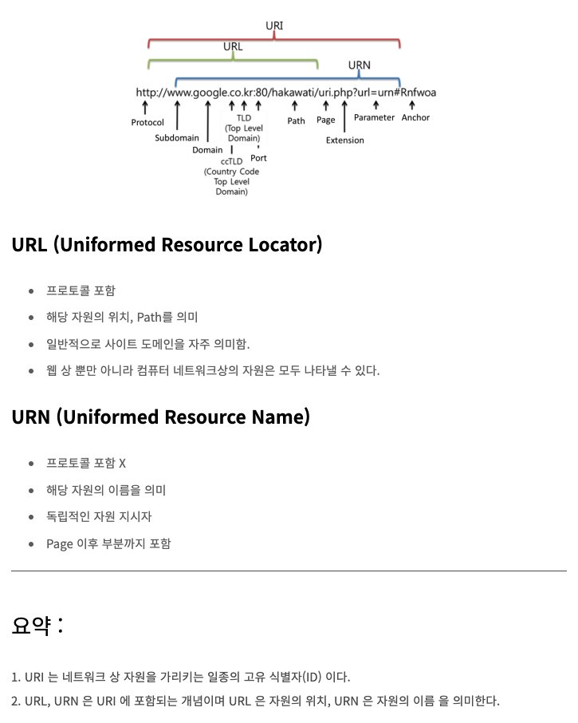
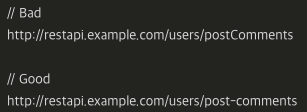
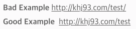
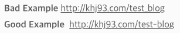
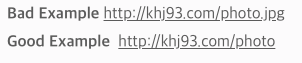

# HTTP 통신 + REST API

## HTTP 통신

---

### http 메소드

- 클라 → 서버에게 요청의 목적을 알리는 수단

### http 메소드 종류

1. GET
    - 데이터 조회
2. POST
    - 서버에 데이터 생성
3. PUT
    - 데이터 변경
4. DELETE
    - 데이터 삭제
5. PATCH
    - 일부 데이터만 변경

### http 상태코드

> 총정리: [https://www.whatap.io/ko/blog/40/](https://www.whatap.io/ko/blog/40/)
> 
- 2xx
    - 요청 성공
    - 200 Ok
    - 201 Created
        - 요청 성공 + 새로운 리소스 생성
        - POST, PUT 결과
- 3xx
    - 이 요청을 완료하기 위해서는 리다이렉션이 되야한다는 의미
    - 서버 측 응답으로 header 의 location 에 실제 리다이렉션 할 url 적어줌
    - 리다이렉션 예
        
        
        
        - 브라우저가 [www.test.com/page1](http://www.test.com/page1) URL 을 웹 서버에 요청했는데, 서버는 HTTP 응답 메시지를 통해 [www.test.com/page2](http://www.test.com/page2) 로 다시 요청하라고 브라우저에게 다른 URL 지시 가능
        - 최초 요청을 받은 웹서버는 HTTP 응답 상태코드로 302 를 전송 & 응답 메시지 헤더 중 Location 값으로 리다이렉트 되어야 할 주소를 설정해 리턴 ⇒ 브라우저는 HTTP 응답 메시지의 상태코드가 302 인걸 보고 리다이렉트임을 인지 ⇒ Location 에 설정되어 있는 URL 로 다시 재요청
- 4xx
    - 클라이언트 측 오류
    - 400 Bad Request
    - 401 Unauthorized
        - 미인증
    - 403 Forbidden
        - 접근권한 X
        - 401 과의 차이: 서버가 클라이언트가 누군지는 알고있음
    - 404 Not Found
        - 없는 url
- 5xx
    - 서버 측 오류
    - 500 Internal Server Error
    - 502 Bad Gateway
        - 서버가 게이트웨이로부터 잘못된 응답 수신
        - 서버가 다른 서버로부터 유효하지 않은 응답을 받은 경우
    - 503 Service Unavailable
        - 유지보수에 의한 작동 중단 || 과부하로 인해 서버가 요청을 처리할 준비 안됨
        - 문제상황을 설명하는 사용자 친화적 응답을 포함해야 함

## REST API

---

### 요약

- http uri 를 통해 자원을 표시하고, http 메소드를 통해 자원에 대해 처리(CRUD)
- http 를 사용함 → http 의 특성을 따르고, 별도의 인프라 구축 필요 X
- JSON, XML 을 통해 데이터를 주고받음
    - 현재 JSON 을 가장 널리 사용!

### URI 란?



### 특징

- 클라이언트 ↔ 서버 아키텍쳐
    - 클라이언트, 서버, 리소스로 구성
    - 서버
        - API 를 제공, 비즈니스 로직 처리 및 저장 담당
    - 클라이언트
        - 사용자 인증이나 context(세션, 로그인 정보) 등을 직접 관리하고 책임짐
- 요청이 HTTP 를 통해 관리됨
- stateless 클라 ↔ 서버 커뮤니케이션
    - HTTP 프로토콜은 Stateless Protocol 이므로 REST 도 똑같
    - 클라이언트의 context 를 서버에 저장 X
    - 서버는 각각의 요청을 완전히 별개의 것으로 인식 후 처리
- 캐시 처리 가능
    - HTTP 프로토콜의 캐싱 기능 적용 가능 (Last-Modified 태그, E-Tag 등)

### 장단점

- 장점
    - HTTP 프로토콜 인프라를 그대로 사용 ⇒ REST API 사용을 위한 별도의 인프라 구축 필요 X
    - 서버, 클라이언트의 명확한 역할 분리
- 단점
    - 표준 자체가 존재하지 않아 정의가 필요
    - 사용할 수 있는 메소드가 제한적
        - HTTP Method 형태

### 좋은 REST API 설계하기 (REST API 네이밍 규칙)

1. URI 는 동사보다 `명사`를
    
    ```
    // bad
    http://example.com/user-management/get-users
    
    // good
    http://example.com/user-management/users
    ```
    
2. 대문자보다 `소문자`를
    - 카멜 방식보다 `하이픈으로 연결된 소문자 구성`이 더 좋다!
        
        
        
3. 마지막에 / (슬래시) 넣지 말자
    
    
    
4. / (슬래시) 구분자로 계층 관계를 나타내자
    
    ex. [http://jimin.com/houses/apartments](http://jimin.com/houses/apartments)
    
5. 언더바 대신 `하이픈`
    - 대신, 가급적 하이픈 사용도 `최소화` 하자
    
    
    
6. 파일 확장자는 포함 X
    
    
    
7. 행위 포함 X
    - 행위는 HTTP Method 를 통해 명시한다
    
    
    

[RESTful API를 위한 6가지 원칙과 네이밍](https://prohannah.tistory.com/156)