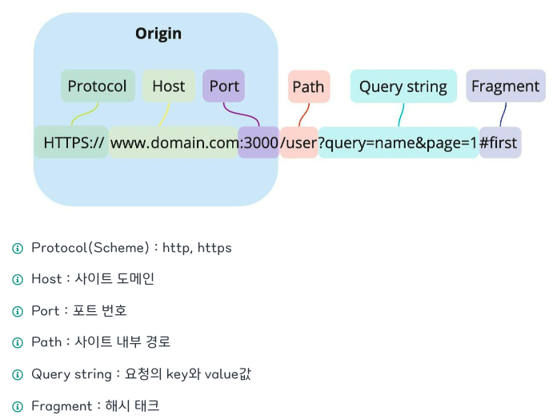
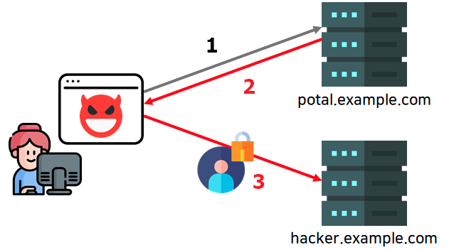
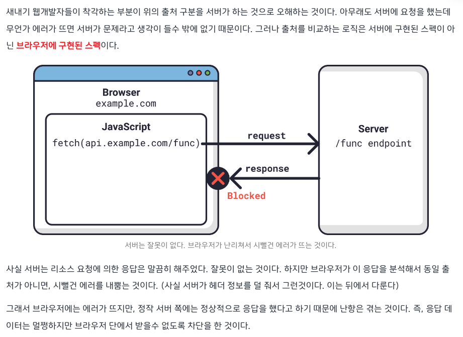
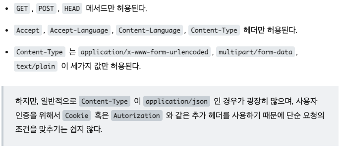
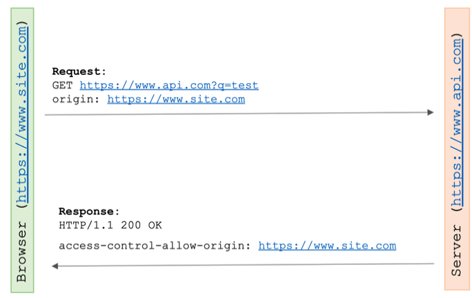
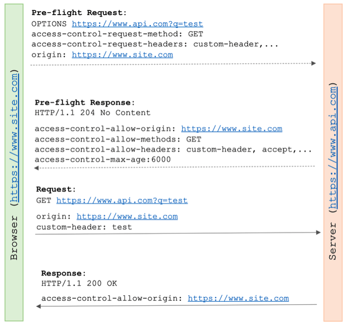
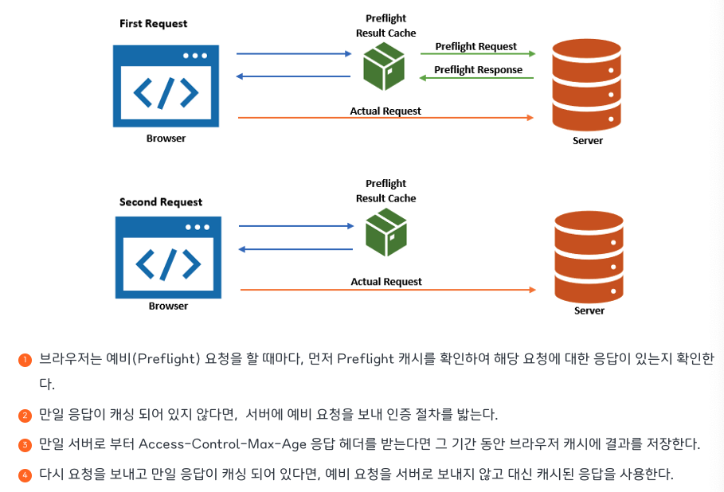

# SOP 와 CORS

## SOP (Same-Origin-Policy)

---

> 동일 origin 에서만 리소스를 공유할 수 있다!
> 

### Origin 이란?



- Protocol + Host + Port
    - 이 세개가 같으면 same-origin

### SOP 가 필요한 이유

- CSRF / XSS 의 위험
    
    
    

### SSR 과의 연관성

- 예전 웹은 프론트엔드/백엔드 를 별도로 구성하지 않는 경우가 대다수
    - 서버가 요청 처리 결과를 html 로 만들어 클라로 전송했음 (SSR 방식)

⇒⇒ 즉, 모든 처리가 같은 origin 내에서 일어난다는 것을 뜻함

- 애초에 다른 origin 으로 요청을 보낼 필요가 없었음

⇒⇒ 다른 origin 으로의 요청은 악의적인 행위(CSRF, XSS) 로 간주

⇒⇒ 브라우저 차원에서 걍 다른 origin 으로의 요청을 막아버리자!

[CORS가 대체 무엇일까? (feat. SOP)](https://hudi.blog/sop-and-cors/)

[🌐 악명 높은 CORS 개념 & 해결법 - 정리 끝판왕 👏](https://inpa.tistory.com/entry/WEB-📚-CORS-💯-정리-해결-방법-👏)

⏩ Node.js / Express.js/ Spring / Nginx / S3 별로 CORS 허용법 나와있음. 굳굳.

## CORS (Cross-Origin-Resource-Sharing)

---

> 서로 다른 도메인(origin) 간 자원을 공유하는 것
> 

> 리소스 호출이 허용된 출처(origin) 을 서버가 명시해놓으면, 출처가 다르더라도 자원 공유가 가능
> 

### CORS 를 일으키는건 서버가 아니라, 브라우저가 하는 것



(+) 클라이언트 단 코드에서 API 요청을 하는게 아니라, 서버 단 코드에서 다른 출처 서버로 API 요청 시, CORS 에러로부터 자유로워짐. 

### CORS 동작의 3가지 시나리오

1. Simple Request (단순 요청)
2. Preflight Request (예비 요청)
3. Credential Request (인증된 요청)

### 1️⃣ Simple Request

> **단순 요청의 조건**
> 
> 
> 
> 



1. 브라우저가 다른 출처로 요청 보낼 시, 자동으로 `HTTP 헤더에 자신의 origin 을 추가하여 요청`
2. 서버는 `응답 헤더에 Access-Control-Allow-Origin` 을 실어 응답
    - Access-Control-Allow-Origin
        - 허가된 출처 정보 명시
        - 와일드카드 사용 시, 모든 출처 허용
3. 브라우저는 `자신의 출처 정보가 Access-Control-Allow-Origin 에 적혀있으면`
    
    ⇒ 해당 요청을 안전하다고 간주 → 응답 가져옴
    
    `젹혀있지 않다면`
    
    ⇒ 응답 파기 + `CORS 에러 발생`
    

<aside>
❗ **단순 요청의 조건은 맞추기 힘들기 때문에, 대부분의 API 요청은 그냥 Preflight 다**

</aside>

### 2️⃣ Preflight Request

> 실제 요청을 보내기 전에 `OPTIONS 메소드`를 통한 `사전 요청`을 보내서 해당 리소스에 접근 가능한지 먼저 확인
> 



1. Pre-flight 요청
    - 브라우저에서 자동으로 전송되는 요청 (프론트 개발자가 직접 보낼 필요 X)
    - `OPTIONS 메소드`
    - `origin 헤더` : 브라우저의 출처
    - `access-control-request-method` : 실제 요청의 메소드
        - ex. GET, POST…
    - `access-control-request-headers` : 실제 요청의 추가 헤더 목록
        - ex. Content-Type…
2. Pre-flight 응답
    - `access-control-allow-origin`
    - `access-control-allow-methods` : 서버 측에서 허용하는 메소드 목록
    - `access-control-allow-headers` : 서버 측에서 허용하는 헤더 목록
    - `access-control-max-age` : preflight 의 캐시 기간
3. 실제 요청, 응답

<aside>
❗ **Preflight 의 캐싱이란**

---

- 서버 요청을 배로 보내야 하므로 실제 요청 처리에 걸리는 시간이 오래걸린다는 단점 보완
- access-control-max-age 에 명시된 시간만큼 preflight 요청을 캐싱



</aside>

<aside>
❗ **Preflight 요청이 필요한 이유**

---

- CORS 는 서버가 아닌 브라우저 측 정책이므로, 서버는 CORS 위반 여부와 상관없이 일단 요청이 들어오면 처리 후 응답해버림
- GET 같은 단순 조회가 아닌 POST/PUT/DELETE 같은 요청인 경우, 서버에 부작용을 발생시킬 수 있음
    - 이러한 부작용은 응답이 유효하지 않아 파기하고 CORS 발생시킨 브라우저와는 무관하게 발생하는 문제

*⇒⇒ 실제 요청이 CORS 를 위반하지 않았는지 미리 확인 후, 부작용으로부터 서버를 보호하기 위함*

</aside>

<aside>
❗ **Postman 같은 API 테스팅 도구에서는 기본적으로 Pre-flight 를 보내지 않는다.**

---

Postman 으로는 api 호출 잘 되는데, 웹브라우저에는 CORS 발생하는 경우 생길 수 있음.

</aside>

### 3️⃣ Credential Request

> `쿠키, 토큰과 같이 사용자 식별 정보가 담긴 요청`일 경우
> 

> 요청 보낼 시, 클라 측에서 `credentials 옵션`을 별도로 설정해줘야 함
> 

> 서버는 응답 시 `Access-Control-Allow-Credentials: true` 로 해줘야 함
> 

> 서버 응답 시 `Access-Control-Allow-Origin, Access-Control-Allow-Methods, Access-Control-Allow-Headers 값으로 * 사용 불가능` ⇒ 엥???????
> 

ex. `fetch` 에서 설정하기 ⇒ `credentials: “include”`

- include: 모든 요청에 인증 정보 담기
- omit: 모든 요청에 인증 정보 담지 않기
- same-origin: 같은 출처 간 요청에만 인증 정보 담기

```jsx
fetch("http://example.com/", {
  method: "PUT",
  credentials: "include",
})
```

ex. `axios` 에서 설정하기 ⇒ `withCredentials: true`

```jsx
axios.post('https://example.com:1234/users/login', { 
    profile: { username: username, password: password } 
}, { 
	withCredentials: true
})
```

<aside>
❗ **기본적으로 브라우저가 제공하는 요청 API 들은 별도의 옵션 없이 브라우저의 쿠키 같은 인증정보를 함부로 요청 데이터에 담지 않도록 되어있음** 
⇒ credentials 꼭 지정해줘야 쿠키를 실어 보낼 수 있다 ~~

</aside>

<aside>
❗ **Credential Request 역시 Preflight 가 먼저 요청된다**

</aside>

### 그래서 CORS 발생 시 해결법은?

- 서버 측
    - `access-control-allow-origin` , `access-control-allow-methods` , `access-control-allow-headers` 설정 체크 ⇒ 정석!
- 클라 측
    - `credential` 잘 보냈는지 체크하자