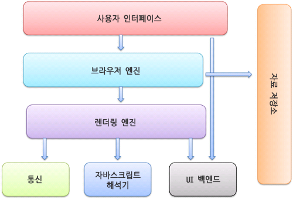

# 사이트에 접속 시 일어나는 일

태그: WEB, 네트워크

## Browser의 기본 구조

## Packet의 기본 구조

## 1. Redirection 여부 확인

- Redirect가 있으면 해당 주소로 접속, 없으면 계속

## 2. Caching

> 브라우저 엔진이 사용자 인터페이스로부터 URI를 받아 자료 저장소를 찾는다.
> 

- 캐싱이 이미 된 요청 → 캐싱된 값을 반환하여 렌더링 엔진에게 전송
(HTML, CSS, image … 등의 Resources)
- 캐싱 없는 새로운 요청 → 계속
- 종류
    - 브라우저 캐시 (Browser Cache)
    : 브라우저 자체가 해당 페이지의 모든 자원들을 가진 상태
    - 개인 캐시 (Private Cache)
    : 클라이언트와 서버 사이에 존재하며, 사용자 간에 공유할 수 있는 응답을 저장
        - 예) Reverse Proxy (Nginx) : 이미 들어왔던(=캐싱된) 요청에 대해 서버 앞단에 있는 프록시서버가 캐싱 응답 데이터를 반환

## 3. DNS : FQDN → IP Address

- [www.google.com](http://www.google.com) 이라는 FQDN에 해당하는 IP Address 반환
- FQDN : Fully Qualified Domain Name
    
    
    
    → 프로토콜을 제외한 Sub Domain + Root Domain = FQDN
    
- DNS 캐싱을 미리 거친 후 동작한다.
    - 캐싱된 값이 있으면 → 바로 IP 주소 반환
    - 캐싱된 값이 없으면 → 계속
    - 종류
        - 브라우저 캐싱
        - OS 캐싱
- DNS 동작 과정 : root → TLD → Domain
    
    
    

## 4. IP Routing + ARP

- DNS(or DNS Cache)로부터 얻은 IP 주소값을 토대로 실제 서버가 있는 위치까지 라우팅
- ARP → 찾은 라우터로부터 실제 서버 MAC주소까지 접근

→ 실제 서버의 정확한 위치를 찾는다.

## 5. TCP HandShake

- 3-way Handshake를 통해 TCP connection 구축 + SSL 연결
- 연결이 된 서버로부터 Response를 받는다.

## 6. Contents Download

---

## 7. Rendering (from Rendering Engine)

> Rendering : 요청 받은 내용을 브라우저 화면에 표시해주는 기능
> 
- 렌더링 엔진 종류
    - Chrome, Safari : `Webkit` Engine
    - Firefox : `Gecko` Engine

### 렌더링 동작 과정 (Webkit 기준)

1. HTML 문서 파싱 후 DOM 노드로 변환한다. (for DOM 트리 구축)
    
    
    
2. CSS 파일 및 스타일 요소들을 파싱한다. (for CSSOM 트리 구축)
    
    
    
3. 한편, JS Engine으로부터 Javascript 파일 파싱 후, Syntax Tree 구축한다.
    
    → 이 Syntax Tree의 속성들이 DOM Tree, CSSOM Tree에 들어가며 Update.
    
4. 렌더 트리를 생성 및 결합한다.
    
    HTML의 DOM트리 + CSS의 CSSOM트리 ⇒ Render Tree
    
5. 렌더 트리 배치 + 그리기를 통해 렌더링 완료
    - 배치 : 화면의 어느 위치에 표시되어야 할 지에 대해 구성
    - 그리기 : 배치값에 따라 실제 정확한 위치에 내용들이 표시 (by UI 백앤드)