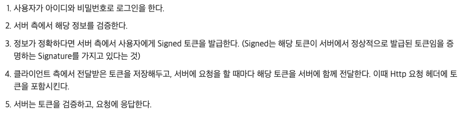
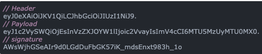

# 쿠키/세션, 토큰 기반 인증

## 쿠키, 세션

> 쿠키/세션에 관한 정리 아주 굳!
- [https://interconnection.tistory.com/74](https://interconnection.tistory.com/74)
- [https://hahahoho5915.tistory.com/32](https://hahahoho5915.tistory.com/32)
> 

> 세션 인증 vs jwt 인증 비교
- [https://velog.io/@znftm97/JWT-Session-Cookie-비교-sphsi9yh](https://velog.io/@znftm97/JWT-Session-Cookie-%EB%B9%84%EA%B5%90-sphsi9yh)
> 

> refresh 토큰이 필요한 이유
- [https://okky.kr/questions/1007579](https://okky.kr/questions/1007579)
> 

---

### 쿠키/세션의 필요성

- http 의 stateless, connectionless 한 특징 때문에 쿠키/세션을 사용하지 않는 경우 사이트에서 페이지를 이동해 다닐 때마다 계속 로그인을 해야 함
- 쿠키/세션을 사용하게 되면, 한 번만 로그인을 하면 어떠한 방식에 의해 그 사용자에 대한 인증을 유지하게 됨

### 쿠키

> **쿠키란?**
> 
- `클라이언트(브라우저) 로컬에 저장`되는 `키-값` 으로 구성된 작은 데이터
- 사용자 인증이 유효한 시간 명시 ⇒ 해당 시간동안은 브라우저가 종료되도 인증이 유지됨
    - ex. 네이버에 로그인했다가 브라우저 닫은 뒤 다시 들어가도 로그인 유지
- 클라이언트에 300개의 쿠키까지 저장 가능 + 하나의 도메인 당 20개까지 가능
- response-header 에 `set-cookie 속성` 활용 시, 클라이언트에 쿠키 만들기 가능
- 쿠키는 유저가 따로 요청하지 않아도 브라우저에서 request 보낼 때 자동으로 request header 에 넣어서 서버에 전송

> **구성요소**
> 
- 이름 : 각각의 쿠키를 구별
- 값 : 쿠키의 값
- 유효시간 : 쿠키의 유지시간
- 도메인 : 쿠키를 전송할 도메인
- 경로 : 쿠키를 전송할 요청 경로

> **동작방식**
> 
1. 클라이언트가 페이지 요청
2. 서버에서 response-header 에 set-cookie 를 줌으로써 쿠키 생성
3. http header 에 쿠키를 포함시켜 응답
4. 브라우저가 종료되어도 쿠키 만료 전이라면 클라에서 보관
5. 같은 요청을 할 경우 클라는 http 헤더에 쿠키를 넣어 보냄

> **사용 예**
> 
- 사이트 로그인 시, “아이디와 비번을 저장하시겠습니까”?
- 팝업에서 “오늘 더이상 이 창을 보지 않음” 체크

### 세션

> **세션이란?**
> 
- 쿠키를 기반하고 있지만, 세션은 `서버 측에서 저장`해두고 관리
- 서버에서 클라를 구분하기 위해, 클라가 request 보내면 그 클라에게 유일한 id 를 부여 ⇒ `세션 id`
- 브라우저가 서버에 접속해서 브라우저를 종료할 때까지(기간 지정 가능) 인증상태 유지
- 사용자 정보를 서버에 두기 때문에 보안 굳
- 사용자가 많아질수록 서버 메모리를 많이 차지

> **동작방식**
> 
1. 클라가 서버 접속 시, 세션 id 를 발급받음
2. 클라는 세션 id 에 대한 쿠키를 저장하여 갖고있음
3. 이후에 클라가 서버에 요청 시, 이 쿠키의 세션 id 를 같이 서버에 전달해서 요청
4. 서버는 세션 id 를 전달받음 → 세션 id 로 세션에 있는 클라 정보를 가져옴
5. 가져온 클라 정보를 가지고 클라의 요청 처리 후, 클라에게 응답

> **특징**
> 
- 각 클라에게 고유한 세션 id 를 부여
- 세션 id 로 클라를 구분 ⇒ 각 클라에게 맞는 서비스 제공
- 쿠키보다 보안 굳
- 사용자가 많아질수록 서버 메모리 많이 차지

> **사용 예**
> 
- 로그인

### 쿠키/세션과 관련해 헷갈리는 점

- 쿠키는 서버에서 set-cookie 를 통해 만들어주는 것
- ~~쿠키가 있어야만 세션이 존재한다!~~
    - 흔히 쿠키 대신 세션을 사용하라는 말도 쿠키를 모두 없애라는 말이 아니다!
        - 중요정보는 세션에 저장하고, 쿠키는 인증키값으로만 사용하라는 뜻
    - url 이나 body 에 세션id 값을 넣는 방안을 사용한다면, “쿠키” 가 없어도 세션은 동작할 수 있다!

### 쿠키와 세션의 차이 비교

|  | 쿠키 | 세션 |
| --- | --- | --- |
| 개념 | 클라이언트(브라우저) 로컬에 저장되는 키-값 으로 구성된 작은 데이터 | - 일정 시간동안 같은 사용자로부터 들어오는 일련의 요구를 하나의 상태로 보고, 그 상태를 유지시키는 기술 - 방문자가 서버에 접속해 있는 상태를 하나의 단위로 보는 것 |
| 저장 위치 | 클라이언트(브라우저) | 서버 |
| 만료 시점 | 쿠키 저장 시 설정 (브라우저가 종료되도, 만료시점이 지나지 않으면 삭제 X) | 브라우저 종료 시 삭제 (기간 지정 가능) |
| 사용하는 리소스 | 클라 리소스 | 서버 리소스 |
| 용량 제한 | 하나의 클라 당 총 300개, 하나의 도메인 당 20개 | 서버가 허용하는 한 제한 X |
| 보안 | 취약 | 강함 |

## 토큰 기반 인증

---

### 토큰 기반 인증이란?

- 인증받은 사용자에게 토큰 발급 + 서버에 요청 시 헤더에 토큰을 함께 보내도록 해 유효성 검사 실시

### 토큰 기반 인증 시스템의 대략적 동작과정

### JWT 란 무엇이고, 특징은?

- 사용자에 대한 정보를 포함하고 있는 Base64 로 인코딩된 json 문자열
- 토큰은 header + payload + signature 세가지 부분으로 구성
    
    
    
    - header: 토큰 타입, 암호화 알고리즘 저장
    - payload: 토큰의 정보. key-value 형태로 쌍을 이루고 있음
    - signature: 토큰을 인코딩하거나 유효성 검증 시 사용하는 암호화 코드
- 회원 정보는 payload 에 담김

### JWT 인증 플로우

1) 클라이언트에서 로그인

2) 서버에서 access token + refresh token 발급

3) 매 요청마다 access token 을 헤더에 담아서 요청

4) access token 만료 시 서버에서 만료 response

5) 클라는 refresh token 으로 갱신 요청

6) 서버는 refresh 의 유효성 체크 후, 새 access 토큰 발급

### JWT 에서 토큰 탈취 경우에 대해…

> access token 의 갱신주기를 짧게 하면 access token 탈취의 위험부담 줄일 수 있
> 

> Q. access token 과 refresh 토큰 모두 클라에 저장되면 같이 탈취당할 위험이 있는게 아닌가?
> 
> - access: 로컬 스토리지 || 세션 스토리지 에 저장
> - refresh: 쿠키에 저장 + 쿠키 보안 옵션(http only, secure cookies) 활성화

> Q. refresh 토큰만 탈취되면? ⇒ 공격자는 탈취된 refresh 토큰으로 계속 access 토큰을 생성해 정상유저처럼 접근가능
> 
> - 해결법: DB 에 유저의 access, refresh 토큰을 매핑하여 저장 (http 의 stateless 를 위반하는건 쩔수없ㅠ)
>     1. 정상 유저가 refresh 토큰으로 access 토큰의 갱신을 요청한 경우
>         - access + refresh 토큰을 서버로 보내서 새 access 토큰 요청 → DB 에 저장된 access, refresh 토큰과 유저가 보낸 access, refresh 토큰을 비교 → 일치 시 새 access 토큰 발급
>     2. 공격자가 refresh 토큰으로 access 토큰의 갱신을 요청한 경우
>         - 탈취한 refresh 토큰으로 새 access 토큰 요청 → access 토큰이 없어 공격으로 간주 → 서버에서 access, refresh 토큰 폐기

> Q. refresh, access 토큰이 모두 탈취된다면?
> 
> - 노답.. 공격자는 정상적인 유저처럼 활동할 수 있다..

## 쿠키/세션 vs 토큰

---

### 요약

- 쿠키/세션
    - 서버에 세션 정보 저장 비용 소모
    - 분산환경에서 관리 어렵
- 토큰
    - 서버 리소스 소모 X (토큰 그 자체가 바로 정보이기 때문)
    - 분산환경 관리 쉬움

### 쿠키/세션 방식의 장단점

- 장점
    - cookie 헤더에 세션id 만 실어 보내면 되므로, JWT 를 매번 실어 보내는 것보다 트래픽 적게 사용
- 단점
    - 세션 저장소라는 서버의 리소스를 소모하게 됨
    - MSA 같은 분산환경에서 관리가 어렵
    - 세션 id 나 cookie 가 탈취당할 경우 ⇒ 세션 저장소를 전부 삭제해 해결 가능 ⇒ 탈취당하지 않은 사용자들의 세션도 지워짐
    - http 이 stateless 특성 위배
        - stateless 라면 서버는 클라의 정보를 저장하지 않아야 하는데, 세션 저장소에 클라 정보가 저장됨

### 토큰 방식의 장단점

- 장점
    - 토큰 그 자체가 인증 정보를 담고있기 때문에 서버의 리소스 소모 x
    - http 의 stateless 한 특징을 유지할 수 있다
- 단점
    - 토큰에 들어가는 정보가 많아져 토큰의 크기가 커지면, 네트워크에 부하를 줄 수 있다
    - jwt 토큰에서 payload 는 암호화된게 아니라 base64 로 인코딩된 것 ⇒ 중간에 토큰 탈취 시 페이로드의 데이터를 볼 수 있다 ⇒ 중요한 정보를 담으면 안됨!