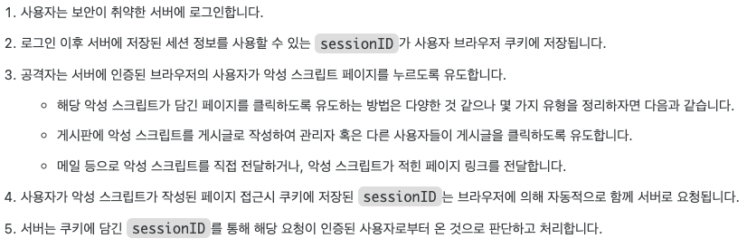

# CSRF & XSS

## CSRF & XSS

---

### CSRF (Cross Site Request Forgery)

- 인터넷 `사용자가 자신의 의지와는 무관하게 공격자가 의도한 행위` (modify, delete, register 등)를 특정한 웹사이트에 request하도록 만드는 공격
- 방식
    
    
    
    
    
- 예시
    - 해커가 사용자의 SNS 계정으로 광고성 글 등록

### CSRF 방어 방법

1. Referer 검증
    - http 헤더에 Referer 존재
        - 해당 요청이 요청된 페이지의 정보 확인 가능
        - 이전에 어떤 도메인을 방문했던건지를 뜻함
    - 승인된 도메인으로 요청했을 경우에만 처리하도록
    - host 값과 referer 값을 비교
        
        ```java
        package blog.in.action.handler;
        
        import org.springframework.web.servlet.HandlerInterceptor;
        
        import javax.servlet.http.HttpServletRequest;
        import javax.servlet.http.HttpServletResponse;
        
        public class ReferrerCheckInterceptor implements HandlerInterceptor {
        
            @Override
            public boolean preHandle(HttpServletRequest request, HttpServletResponse response, Object handler) throws Exception {
                String referer = request.getHeader("Referer");
                String host = request.getHeader("host");
                if (referer == null || !referer.contains(host)) {
                    response.sendRedirect("/");
                    return false;
                }
                return true;
            }
        }
        ```
        

1. CSRF 토큰 검증
    - 사용자의 세션에 임의의 난수 값 지정 → 사용자 요청 시 해당 값을 포함하여 전송
    - 서버에서 요청 받을 때 `세션에 저장된 토큰값 == 요청 파라미터로 온 토큰값`이 일치하는지 확인

<aside>
❓ **Spring-Boot 의 CSRF disable 설정 과연 안전한가**

---

- Spring Security 는 기본적으로 CSRF 공격에 대한 방지를 수행
- [ 예전에 많이 사용되었던 MVC 구조인 경우 ]
    - 세션, 쿠키를 통해 사용자 인증을 수행했기 때문에 CSRF 공격에 취약
    - 쿠키가 CSRF 공격의 매개체이기 때문에, 쿠키가 없으면 CSRF 공격도 없다!
- [ 최근에 많이 사용되는 REST API 방식 ]
    - 보통 JWT + 로컬 스토리지 + 요청 헤더 사용
        - 하지만, 로컬 스토리지 사용 시 XSS 공격에는 취약하다
    - 쿠키/세션에 의존하지 않는 경향이 크기 때문에 disable 해도 괜찮다
</aside>

### XSS (Cross Site Scripting)

- 게시판이나 메일에 스크립트 코드(javascript)를 삽입 → 개발자가 고려하지 않은 기능이 작동하도록
- 사용자의 세션을 공격자 서버로 전송 || 악성코드가 있는 페이지로 리다이렉트 시키기
1. Reflected XSS
2. Stored XSS

### XSS 방어 방법

1. 입력 값 제한
    - 사용자 입력 데이터에 대한 길이/문자/형식 검증하기
2. 입력 값 치환
    - XSS 공격은 대부분 script 태그를 사용하기 때문에
        - 태그문자(<,>) 같은 위험한 문자는 HTML entity 로 변경
            - script 태그를 그냥 아무런 의미 없는 일반문자로 인식하게 할 수 있음
3. 라이브러리 이용
    - 여러 회사들에서 제공하는 Anti XSS 라이브러리 사용

### CSRF 와 XSS 의 차이

- CSRF
    - **특정 웹사이트가 사용자의 브라우저를 신용**하여 발생하는 공격
    - 쿠키 필요 → 공격하는데 쿠키가 필요하다!
        - 쿠키를 얻어서 정상유저인 척하고 서버에 이상한 작업 수행
    - 서버를 대상으로 하는 공격
- XSS
    - **사용자가 웹사이트를 신용**하여 발생하는 공격
    - 쿠키 기반 공격 X
        - 서버에 요청을 보낼수 없고, 클라이언트를 공격한다
    - 클라이언트를 대상으로 하는 공격