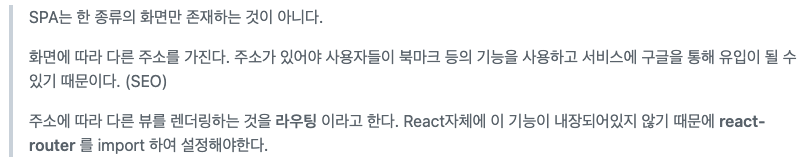

# CSR & SSR

## CSR vs SSR

---

### 서버 사이드 렌더링 (SSR)

- 전통적인 웹 방식에서 많이 사용했음
- 서버가 브라우저에 나타나는 형태 그대로를 HTML로 만들어 제공 → 브라우저는 HTML을 표시하는 방식
    - 이 후에는 일부 HTML과 Script만 브라우저로 전달 → 브라우저에서 Script를 실행시켜 서버에서 데이터를 조회하여 HTML을 완성하는 방식 (ajax)

### SSR 의 장단점

- 장점
    - 검색엔진 최적화(SEO 기능)
        - 웹 사이트가 검색 방식을 통해 검색 엔진에서 상위에 노출될 수 있도록 최적화하는 과정
        - SSR 의 가장 큰 장점
    - 초기 로딩 속도가 빠름
- 단점
    - CSR에 비해 성능문제 이슈
        - 요청 시 마다 새로고침
        - 페이지를 로딩할 때마다 서버로부터 리소스를 전달받아 해석하고 화면에 렌더링하는 방식
            
            (사용자와 인터렉션이 많은 웹앱에는 적절하지 못한 방법, 불필요한 트래픽과 서버 자원 사용이 생기기 때문)
            

### 클라이언트 사이드 렌더링 (CSR)

- SPA (Single Page Application)
    - SPA 는 한 화면만 존재하나? ⇒ 그건 아님
        
        
        
- 클라이언트 입장에서 필요한 부분만 다시 렌더링
- 서버는 JSON파일만 보내주고, HTML을 그리는 역할은 JavaScript를 통해 클라이언트 측에서 수행

### CSR 의 장단점

- 장점
    - SSR 보다 트래픽 감소
    - 사용자 경험 : 새로고침이 발생하지 않아, 사용자가 네이티브 앱과 비슷한 경험을 할 수 있다.
- 단점
    - 초기 구동속도 느림
    - 검색엔진: 자바스크립트 엔진이 동작하지 않으면 원하는 정보를 표시해주지 못한다.