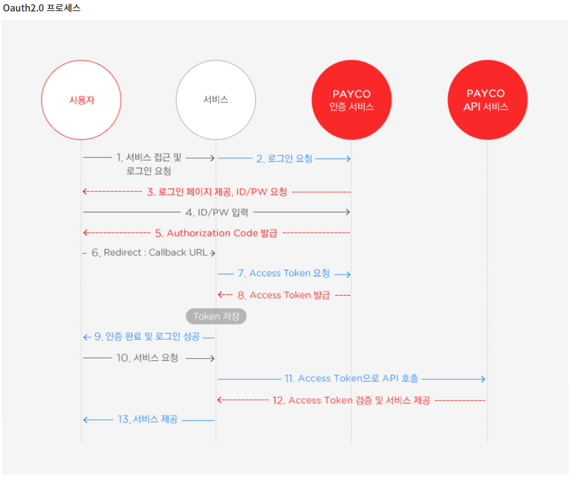

# OAuth + JWT + 인증방식

# OAuth란?

클라이언트가 사용자정보(ID, 비밀번호)를 제공하지 않고 다른 웹사이트 상의 자신들의 정보에 대해 접근 권한을 부여할 수 있는 공통적인 수단으로 사용되는 프로토콜이다.

쉽게 말해서, 고객이 안전하게 다른 서비스의 정보를 우리 서비스에 건네주기 위한 방법

## Oauth 2.0 프로세스

1. 클라이언트가 Other Server(네이버, 구글, 깃허브 등 로그인이 필요한 서비스)로부터 로그인을 성공적으로 한다.
2. 클라이언트의 로그인이 성공적이라서, Other Server로부터 Authorization Code를 발급받는다.
3. 클라이언트가 My Server로 Authorization Code를 건네준다.
4. My Server는 Autorization Code를 통해 Other Server로 Access Token을 요청하고, 발급받는다.
5. 클라이언트로부터 My Server를 통해 Other Server의 서비스를 이용하고자 할 때마다, My Server는 Other Server로 Access Token과 함께 요청한다.
6. My Server가 Other Server로부터 제공받은 서비스를 통해 클라이언트에게 일련의 서비스들을 제공한다.

### 이미 합의된 redirect_uri여야만 서비스를 제공받을 수 있다.

# JWT란?

Json Web Token의 약자로, 모바일이나 웹의 사용자 인증을 위해 사용되는 암호화된 토큰이다.

Stateless하므로 클라이언트에서는 요청을 보낼 때마다 토큰을 함께 전송하고, 서버는 토큰 값이 유효한지 검증한 후에 정상이라면 응답한다.

## JWT에 담기는 정보

1. 헤더
    - 토큰의 타입과 해시 암호화 알고리즘
2. 페이로드
    - 토큰에 담을 정보들(registered claim + public claim + private claim)
    - registered claim : 토큰 정보를 표현하기 위해 정해진 종류의 데이터들이며, 정해진 것들 중 선택적으로 골라 작성한다
    - public claim : 사용자 정의 클레임으로, 공개용 정보를 위해 사용된다. 충돌 방지를 위해 URI 포맷을 사용한다
    - private claim : 사용자 정의 클레임으로, 서버와 클라이언트 사이에 임의로 지정한 정보를 저장한다.
3. 시그니쳐
    - 토큰을 인코딩하거나 유효성 검증을 할 때 사용되는 고유한 암호화 코드이다.
    - 헤더와 페이로드의 값을 각각 Base64로 인코딩한 후 인코딩 된 값을 Secret Key를 이용해 헤더에서 정의한 알고리즘으로 암호화하고 이를 다시 Base64로 인코딩하여 생성한다.

## JWT의 장단점

### 장점

- 서버에서 유지해야하는 세션과 달리, Stateless한 token 값만 확인하면 되므로 서버에 부담이 덜하다.
- 보안상 쿠키를 사용하지 않아도 되므로, 쿠키를 사용함으로써 발생하는 취약점이 사라진다.

### 단점

- claim에 넣는 데이터가 많아질 수록 JWT 토큰이 길어지므로, 네트워크 대역폭 낭비가 심해진다.
- Stateless하므로 서버에서 임의로 삭제하는 것이 불가능하다. 따라서 토큰 만료 시간을 넣어서 관리해야 한다.
- 토큰 자체에 정보를 담고 있으므로 위험 요소가 존재하여, JWE(JSON Web Encryption)을 통해 암호화하거나 중요 데이터를 페이로드에 넣으면 안된다.

정보 및 이미지 출처

[JWT, OAuth (velog.io)](https://velog.io/@dewgang/JWT-OAuth)

[OAuth 2.0, JWT (tistory.com)](https://gilssang97.tistory.com/55)