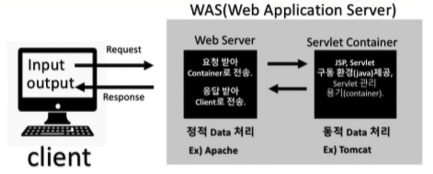
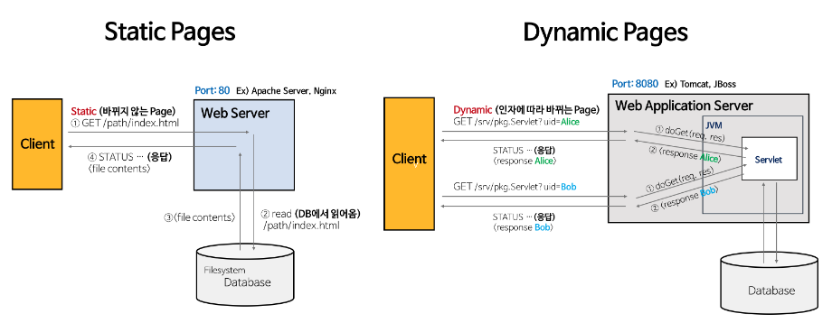
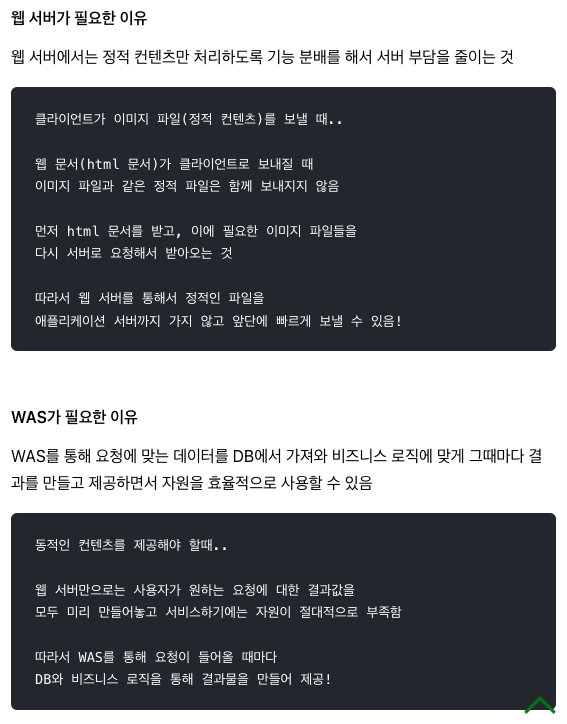

# Web Server 와 WAS

## Web Server vs WAS

---

### Web Server 란?

- 개념
    - 하드웨어
        - web 서버가 설치되어 있는 컴퓨터
    - 소프트웨어
        - 웹 브라우저 클라이언트로부터 HTTP 요청을 받고, 정적인 컨텐츠(html, css 등)를 제공하는 컴퓨터 프로그램
- 기능
    - 클라이언트로부터 HTTP 요청(GET/PUT/POST 등) 받아들임
    - **정적 데이터 처리**
        - 단순 이미지, html 파일
    - 동적 컨텐츠 제공을 위한 **요청 전달**
        - 웹 컨테이너로부터 받은 결과물을 클라이언트에게 전달(HTML 형태로)
- 예시
    - Apache, Nginx

### WAS (Web-Application-Server) 란?

- `웹 서버` + `서블릿 컨테이너`

- `서블릿 컨테이너 (웹 컨테이너)`
    - JSP 와 Servlet 을 실행시킬 수 있는 SW
    - 웹 서버와 소켓을 만들어 통신
    - 기능
        - **동적 데이터 처리**
            - DB 연결해 데이터 주고받기
            - 자바를 이용한 데이터 조작
        - 서블릿들을 관리
            - 클라이언트의 요청에 대해 어떤 서블릿을 실행할지 제어
            - 서블릿
                - HttpServlet 클래스를 상속한 클래스
                    - `doGet(),doPost()` 메소드 ← 개발자가 구현
                - 클라이언트의 요청을 처리하고, 그 결과를 반환
                    - Spring MVC 에서 Controller 로 사용됨
                - servlet 클래스의 구현 규칙을 지킨 자바 웹 프로그래밍 기술
                - 스프링부트에서 서블릿 사용은 권장 X
    - 예시
        - Tomcat

### Spring-Boot 의 WAS

- 내장 WAS 를 가짐
- 서버 내장하여 배포 → jar 파일로 배포 / WAS 환경이 이미 존재하여 스프링부트 애플리캐이션만을 배포 → war 파일로 배포
- 스프링부트에서는 내장 WAS 사용 권장
    - 외장 WAS 사용 시 새로운 서버가 추가되면 모든 서버가 같은 WAS 환경 구축해야..ㅠ

### 둘을 나누는 이유는?

- 기능 분배 → 서버 부담 줄이기
    
    