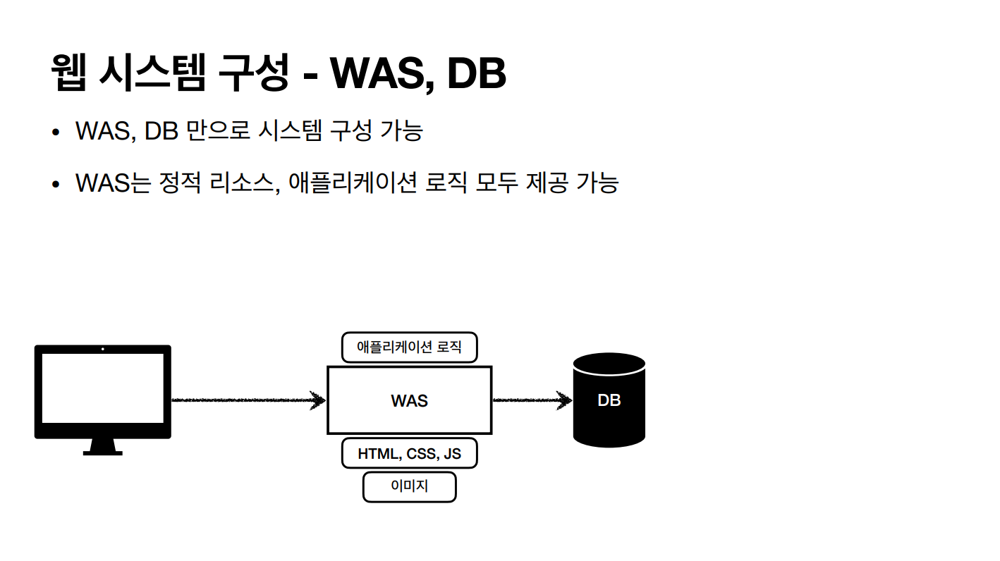

# Web Server와 WAS가 무엇인지

## 웹 서버(Web Server)

- HTTP 기반으로 동작
- 정적 리소스 제공 ( 플러그인 활용하면 코드 실행도 가능하다. )
- 정적 HTML, CSS, JS, 이미지, 영상 등
- 예) NGINX, APACHE

## 웹 애플리케이션 서버(WAS, Web Application Server)

- HTTP 기반으로 동작
- 웹 서버 기능 포함 (정적 리소스 제공 가능)
- 프로그램 코드를 실행해서 애플리케이션 로직 수행
    - 서블릿, JSP, 스프링 MVC
- 예) 톰캣(Tomcat),

## 둘의 결정적인 차이는 무엇인가?

- 웹 서버도 프로그램을 실행하는 기능을 수행할 수 있기는 함
- WAS도 정적 리소스 제공 가능함
- 다만, 웹 서버는 정적 리소스, WAS는 애플리케이션 로직으로 역할을 분명하게 나누는 것

(출처 : 스프링 MVC 1편 - 김영한)

## 근데 왜 WAS랑 DB만으로 서버를 구성하지 않을까?

- WAS가 너무 많은 역할을 담당 → 서버 과부하 우려
- WAS 장애시 오류 화면도 노출 불가능 ( 애플리케이션 로직이 동작하고 있는 WAS 서버는 잘 다운됨 )

→ 효율적인 리소스 관리가 가능하다.

**정적 리소스가 많이 사용되면 Web Server 증설, 애플리케이션 로직이 많이 실행되면 WAS 증설**