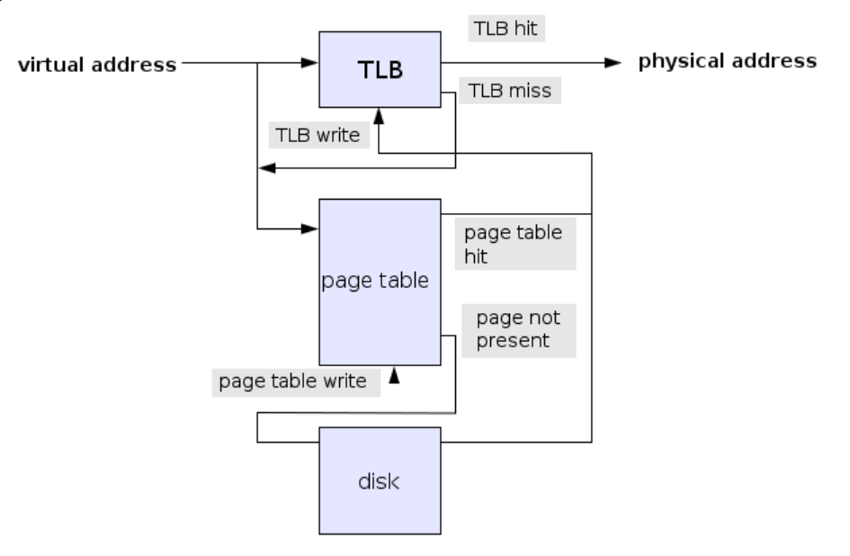

# 메모리, 가상 메모리, 메모리 저장 방식

## 가상 메모리(Virtual Memory)

물리 메모리의 크기와 상관없이 프로세스에 커다란 메모리 공간을 제공하는 것처럼 보이게 하는 기술

가상 메모리에서 메모리 관리자가 사용할 수 있는 메모리의 전체 크기는 **물리 메모리와 디스크의 스왑 영역을 합한 크기**다.

가상 메모리 시스템에서 메모리 관리자는 물리 메모리와 스왑 영역을 합쳐서, 프로세스가 사용하는 가상 주소를 실제 메모리의 물리 주소로 변환한다.

이러한 작업을 **동적 주소 변환**이라고 한다.

동적 주소 변환 과정은 다음과 같다.

[[운영체제] 가상 메모리와 페이징 시스템 (velog.io)](https://velog.io/@wejaan/%EC%9A%B4%EC%98%81%EC%B2%B4%EC%A0%9C-%EA%B0%80%EC%83%81-%EB%A9%94%EB%AA%A8%EB%A6%AC)